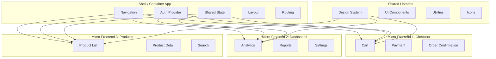
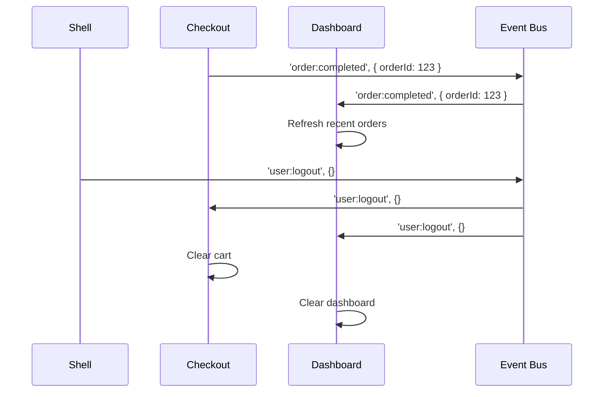
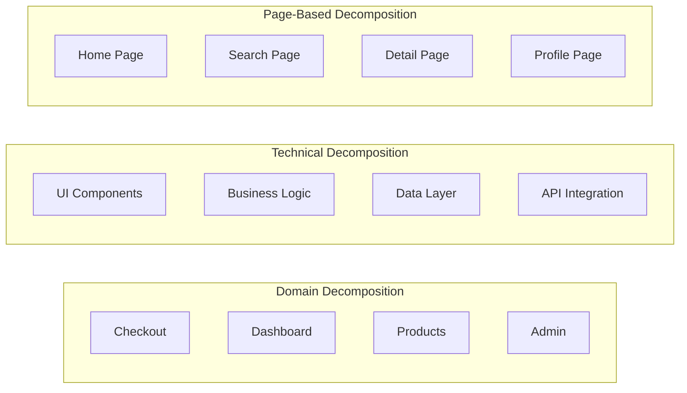
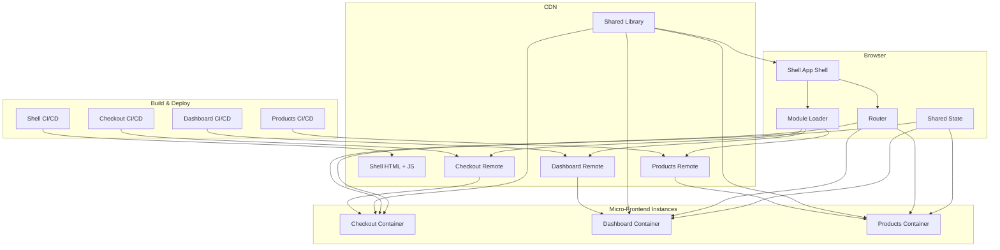

# Micro-Frontend Design

Micro-frontends extend microservice principles to frontend development, allowing independent teams to develop, test, and deploy features independently.

## When to Use Micro-Frontends

- Large teams (50+ developers)
- Multiple autonomous product teams
- Independent deployment required
- Long-lived project (years)
- Migrating from legacy monolithic frontend
- Different teams use different tech stacks

## Architecture Patterns



## Integration Approaches

### 1. Module Federation (Webpack 5)

```javascript
// shell/webpack.config.js
const { ModuleFederationPlugin } = require('webpack').container;

module.exports = {
  plugins: [
    new ModuleFederationPlugin({
      name: 'shell',
      remotes: {
        checkout: 'checkout@https://checkout.example.com/remoteEntry.js',
        dashboard: 'dashboard@https://dashboard.example.com/remoteEntry.js',
        products: 'products@https://products.example.com/remoteEntry.js',
      },
      shared: {
        react: { singleton: true, requiredVersion: '^18.0.0' },
        'react-dom': { singleton: true, requiredVersion: '^18.0.0' },
        '@shared/ui': { singleton: true },
      },
    }),
  ],
};
```

```javascript
// checkout/webpack.config.js
module.exports = {
  plugins: [
    new ModuleFederationPlugin({
      name: 'checkout',
      filename: 'remoteEntry.js',
      exposes: {
        './Cart': './src/Cart',
        './Payment': './src/Payment',
        './OrderConfirmation': './src/OrderConfirmation',
      },
      shared: {
        react: { singleton: true },
        'react-dom': { singleton: true },
      },
    }),
  ],
};
```

```javascript
// Shell app - lazy loading remote modules
const Cart = React.lazy(() => import('checkout/Cart'));
const Dashboard = React.lazy(() => import('dashboard/Dashboard'));
const Products = React.lazy(() => import('products/ProductList'));

function App() {
  return (
    <Suspense fallback={<Loading />}>
      <Router>
        <Route path="/cart" element={<Cart />} />
        <Route path="/dashboard" element={<Dashboard />} />
        <Route path="/products" element={<Products />} />
      </Router>
    </Suspense>
  );
}
```

### 2. Iframe (Simple but Limited)

```html
<!-- Shell -->
<nav>
  <a href="/app1" data-mfe="app1">App 1</a>
  <a href="/app2" data-mfe="app2">App 2</a>
</nav>
<iframe id="mfe-container" src="https://app1.example.com"></iframe>

<script>
  // Communication between shell and iframes via postMessage
  const iframe = document.getElementById('mfe-container');

  // Send auth token to iframe
  iframe.contentWindow.postMessage({
    type: 'AUTH_TOKEN',
    payload: { token: 'abc123' }
  }, '*');

  // Listen for events from iframe
  window.addEventListener('message', (event) => {
    if (event.data.type === 'NAVIGATE') {
      // Handle navigation from micro-frontend
      history.pushState(null, '', event.data.payload.path);
    }
  });
</script>
```

### 3. Web Components (Framework Agnostic)

```javascript
// Custom element wrapper for React component
import React from 'react';
import { createRoot } from 'react-dom/client';

class CartWidget extends HTMLElement {
  connectedCallback() {
    const mountPoint = document.createElement('div');
    this.appendChild(mountPoint);
    const root = createRoot(mountPoint);
    root.render(React.createElement(Cart, { ...this.dataset }));
  }
}

customElements.define('cart-widget', CartWidget);
```

```html
<!-- Shell app uses web component -->
<cart-widget
  data-user-id="123"
  data-theme="dark"
></cart-widget>

<script>
  // Update attributes
  document.querySelector('cart-widget').dataset.userId = '456';
</script>
```

## Communication Between Micro-Frontends



```javascript
// Shared Event Bus
class EventBus {
  private listeners: Map<string, Set<Function>> = new Map();

  on(event: string, callback: Function) {
    if (!this.listeners.has(event)) {
      this.listeners.set(event, new Set());
    }
    this.listeners.get(event)!.add(callback);
    
    return () => this.listeners.get(event)?.delete(callback);
  }

  emit(event: string, data?: unknown) {
    this.listeners.get(event)?.forEach(callback => {
      try {
        callback(data);
      } catch (error) {
        console.error(`Event bus error: ${event}`, error);
      }
    });
  }

  off(event: string, callback: Function) {
    this.listeners.get(event)?.delete(callback);
  }
}

// Global singleton
window.__eventBus = new EventBus();
```

## Shared Libraries

```javascript
// shared/package.json
{
  "name": "@company/shared",
  "version": "1.0.0",
  "main": "dist/index.js",
  "exports": {
    "./ui": "./dist/ui/index.js",
    "./utils": "./dist/utils/index.js",
    "./types": "./dist/types/index.js"
  }
}
```

```typescript
// shared/src/ui/Button.tsx - versioned, breaking changes = major version
import { loadable } from '@company/shared/utils';

export const Button = loadable(() => import('./Button'));

export { ButtonProps } from './Button';
```

**Shared Library Versioning Strategy:**
- **Major:** Breaking UI changes (v1 → v2)
- **Minor:** New components, non-breaking additions
- **Patch:** Bug fixes, internal improvements

## Decomposition Strategies



## Micro-Frontend Architecture Diagram



## Pros and Cons

| Pros | Cons |
|------|------|
| Independent deployability | Increased bundle size |
| Team autonomy | Shared dependencies complexity |
| Technology diversity | Cross-cutting concerns |
| Scalable development | Testing across boundaries |
| Isolation (one MF crashes != all crash) | Performance overhead |
| Incremental upgrades | Higher DevOps complexity |
| Simplified code ownership | Coordination overhead |

## Best Practices

- **Keep shared libraries minimal** and versioned
- **Agree on communication protocols** (events, props, shared state)
- **Establish clear ownership** of each micro-frontend
- **Set performance budgets** for each remote entry
- **Implement consistent routing** between micro-frontends
- **Share design system** but not implementation details
- **Version shared dependencies** explicitly
- **Test integration points** thoroughly
- **Monitor loading performance** of remote modules
- **Fail gracefully** when a micro-frontend fails to load

## Resources
- [Module Federation](https://module-federation.io/)
- [Micro Frontends (Martin Fowler)](https://martinfowler.com/articles/micro-frontends.html)
- [Single SPA Framework](https://single-spa.js.org/)
- [Web Components](https://developer.mozilla.org/en-US/docs/Web/Web_Components)
- [Micro Frontends in Action (Book)](https://www.manning.com/books/micro-frontends-in-action)
