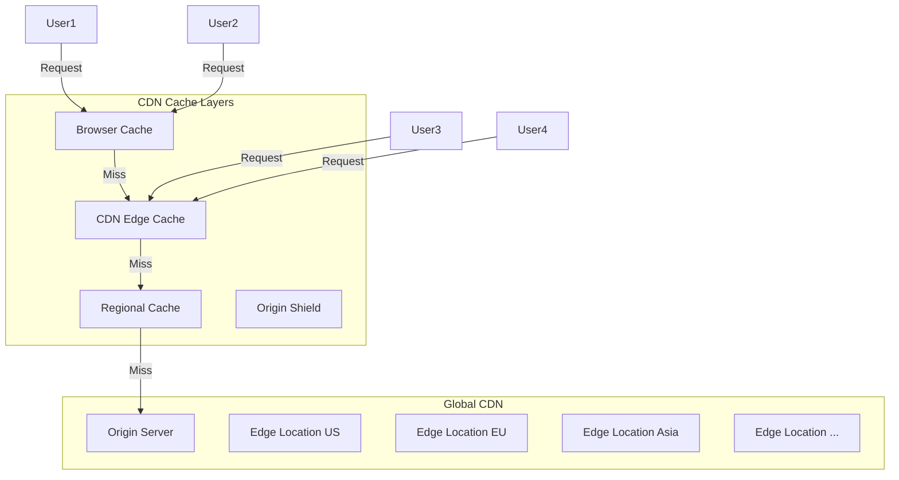

# Performance at Scale

Performance patterns for large frontend applications that serve millions of users across the globe.

## Performance Principles

```mermaid
graph TB
    subgraph "Performance Pillars"
        A[Load Performance]
        B[Runtime Performance]
        C[Perceptual Performance]
        D[Network Performance]
    end
    
    subgraph "Load Performance"
        A1[Code Splitting]
        A2[Tree Shaking]
        A3[Asset Optimization]
        A4[CDN Distribution]
    end
    
    subgraph "Runtime Performance"
        B1[Virtual Scrolling]
        B2[Worker Threads]
        B3[Debounce/Throttle]
        B4[Layout Optimization]
    end
    
    subgraph "Perceptual Performance"
        C1[Skeleton Screens]
        C2[Progressive Loading]
        C3[Optimistic UI]
        C4[Loading Priorities]
    end
    
    subgraph "Network Performance"
        D1[HTTP/2 & HTTP/3]
        D2[Resource Hints]
        D3[Compression]
        D4[Edge Computing]
    end
    
    A --> A1
    A --> A2
    A --> A3
    A --> A4
    
    B --> B1
    B --> B2
    B --> B3
    B --> B4
    
    C --> C1
    C --> C2
    C --> C3
    C --> C4
    
    D --> D1
    D --> D2
    D --> D3
    D --> D4
```



## Performance Budgets

```javascript
// performance-budget.js
const BUDGET = {
  // Time budgets
  TTFB: 800,       // Time to First Byte (ms)
  FCP: 1800,       // First Contentful Paint (ms)
  LCP: 2500,       // Largest Contentful Paint (ms)
  TBT: 200,        // Total Blocking Time (ms)
  CLS: 0.1,        // Cumulative Layout Shift
  INP: 200,        // Interaction to Next Paint (ms)
  
  // Size budgets
  totalJS: 200,     // KB (gzip)
  totalCSS: 50,     // KB (gzip)
  totalImages: 500, // KB
  totalFonts: 50,   // KB
  
  // Count budgets
  requests: 30,     // Total HTTP requests
  DOMNodes: 1500,   // Max DOM nodes
  thirdParty: 5,    // Third-party scripts
};

// Validate against budget
const perfObserver = new PerformanceObserver((list) => {
  for (const entry of list.getEntries()) {
    if (entry.name === 'largest-contentful-paint' && entry.startTime > BUDGET.LCP) {
      reportViolation('LCP exceeded budget', { actual: entry.startTime, budget: BUDGET.LCP });
    }
  }
});
perfObserver.observe({ type: 'largest-contentful-paint', buffered: true });
```

## Lazy Loading Strategies

### Route-Level Code Splitting

```javascript
// React Router with lazy loading
const Dashboard = lazy(() => import('./pages/Dashboard'));
const Analytics = lazy(() => import('./pages/Analytics'));

// Preload critical routes on hover
function SidebarLink({ to, component, children }) {
  const preload = () => {
    const preloadPromise = component(); // Trigger lazy load
  };

  return (
    <Link
      to={to}
      onMouseEnter={preload}
      onFocus={preload}
    >
      {children}
    </Link>
  );
}
```

### Component-Level Splitting

```javascript
// Lazy load heavy components
const RichTextEditor = lazy(() => import('./RichTextEditor'));
const ChartComponent = lazy(() => import('./ChartComponent'));
const ImageGallery = lazy(() => import('./ImageGallery'));

// Conditional loading
function Dashboard({ viewMode }) {
  return (
    <Suspense fallback={<Skeleton />}>
      {viewMode === 'chart' ? <ChartComponent /> : <DataTable />}
    </Suspense>
  );
}
```

### Intersection Observer for Below-the-Fold

```jsx
function LazyImage({ src, alt, ...props }) {
  const [isVisible, setIsVisible] = useState(false);
  const imgRef = useRef(null);

  useEffect(() => {
    const observer = new IntersectionObserver(
      ([entry]) => {
        if (entry.isIntersecting) {
          setIsVisible(true);
          observer.disconnect();
        }
      },
      { rootMargin: '200px' } // Start loading before visible
    );

    if (imgRef.current) observer.observe(imgRef.current);
    return () => observer.disconnect();
  }, []);

  return (
    <div ref={imgRef} style={{ minHeight: 200 }}>
      {isVisible ? (
        
      ) : (
        <div className="image-placeholder" />
      )}
    </div>
  );
}
```

## CDN Strategies



## Resource Hints

```html
<!-- DNS prefetch - resolve domain early -->
<link rel="dns-prefetch" href="//api.example.com" />

<!-- Preconnect - full TCP/TLS handshake -->
<link rel="preconnect" href="https://fonts.googleapis.com" />

<!-- Prefetch - low priority for future navigation -->
<link rel="prefetch" href="/dashboard" as="document" />

<!-- Preload - high priority for current page -->
<link rel="preload" href="/fonts/inter-var.woff2" as="font" crossorigin />

<!-- Preload critical assets -->
<link rel="preload" href="/hero.webp" as="image" />
<link rel="preload" href="/main.js" as="script" />
<link rel="preload" href="/main.css" as="style" />
```

```javascript
// Programmatic prefetching
const prefetched = new Set();

function prefetchRoute(path) {
  if (prefetched.has(path)) return;
  prefetched.add(path);
  
  const link = document.createElement('link');
  link.rel = 'prefetch';
  link.href = path;
  document.head.appendChild(link);
}

// Predict user navigation
// Prefetch when hovering over links
document.addEventListener('mouseover', (e) => {
  const link = e.target.closest('a');
  if (link && link.href.startsWith(window.location.origin)) {
    prefetchRoute(link.href);
  }
});
```

## Virtual Scrolling

```javascript
// Virtual list for large datasets
function VirtualList({ items, itemHeight, windowHeight }) {
  const [scrollTop, setScrollTop] = useState(0);
  
  const totalHeight = items.length * itemHeight;
  const visibleCount = Math.ceil(windowHeight / itemHeight);
  const startIndex = Math.floor(scrollTop / itemHeight);
  const endIndex = startIndex + visibleCount + 2; // Overscan
  
  const visibleItems = items.slice(startIndex, endIndex);
  
  return (
    <div
      style={{ height: windowHeight, overflow: 'auto' }}
      onScroll={(e) => setScrollTop(e.target.scrollTop)}
    >
      <div style={{ height: totalHeight, position: 'relative' }}>
        {visibleItems.map((item, i) => (
          <div
            key={item.id}
            style={{
              position: 'absolute',
              top: (startIndex + i) * itemHeight,
              height: itemHeight,
              width: '100%',
            }}
          >
            <MemoizedItem item={item} />
          </div>
        ))}
      </div>
    </div>
  );
}

// For 100,000 items:
// Without virtual scroll: 100,000 DOM nodes
// With virtual scroll: ~20 DOM nodes rendered at a time
```

## Web Workers for Heavy Computation

```javascript
// worker.js
self.onmessage = function(event) {
  const { data } = event;
  
  // Heavy computation
  const result = processData(data);
  
  self.postMessage(result);
};

function processData(data) {
  // Complex data transformation
  return data.map(item => ({
    ...item,
    computed: expensiveFunction(item),
    hash: generateHash(item),
  }));
}

// Main thread
const worker = new Worker('/worker.js');

function processInBackground(data) {
  return new Promise((resolve, reject) => {
    worker.postMessage(data);
    worker.onmessage = (event) => resolve(event.data);
    worker.onerror = (error) => reject(error);
  });
}

// Usage
const processed = await processInBackground(largeDataset);
```

## Performance Monitoring

```javascript
// Custom performance marks and measures
function measureComponentRender(name) {
  performance.mark(`${name}-start`);
  
  return () => {
    performance.mark(`${name}-end`);
    performance.measure(name, `${name}-start`, `${name}-end`);
    
    const entries = performance.getEntriesByName(name);
    const duration = entries[entries.length - 1].duration;
    
    if (duration > 16) { // 60fps threshold
      reportSlowRender(name, duration);
    }
    
    performance.clearMarks(`${name}-start`);
    performance.clearMarks(`${name}-end`);
  };
}

// In component
function ExpensiveList({ data }) {
  const endMeasure = useRef(null);
  
  useEffect(() => {
    endMeasure.current = measureComponentRender('ExpensiveList');
    return endMeasure.current;
  });
  
  useEffect(() => {
    if (endMeasure.current) endMeasure.current();
  });
  
  return <div>{/* render list */}</div>;
}
```

## Performance Checklist

### Build Time
- [ ] Enable code splitting (route-level + component-level)
- [ ] Tree shake unused imports
- [ ] Minify JS, CSS, HTML
- [ ] Enable scope hoisting
- [ ] Generate content hashes for caching

### Asset Optimization
- [ ] Use modern image formats (WebP, AVIF)
- [ ] Responsive images with srcset
- [ ] Lazy load below-the-fold images
- [ ] Preload hero images
- [ ] Optimize and subset fonts
- [ ] Compress with Brotli/Gzip

### Runtime
- [ ] Virtual scroll for long lists
- [ ] Web Workers for CPU-intensive tasks
- [ ] Debounce/throttle event handlers
- [ ] Avoid layout thrashing
- [ ] Use CSS animations instead of JS
- [ ] Batch DOM updates

### Network
- [ ] Use CDN with edge caching
- [ ] HTTP/2 or HTTP/3
- [ ] Preconnect to critical origins
- [ ] Prefetch future navigations
- [ ] Implement service worker caching
- [ ] Optimize API response sizes

### Monitoring
- [ ] Set performance budgets
- [ ] Track Core Web Vitals
- [ ] Monitor in CI/CD pipeline
- [ ] Alert on regressions
- [ ] Analyze RUM data regularly

## Resources
- [Web Vitals](https://web.dev/vitals/)
- [Lighthouse Performance Scoring](https://developer.chrome.com/docs/lighthouse/performance/performance-scoring/)
- [Patterns for Performance](https://web.dev/patterns/)
- [Fast Load Times](https://web.dev/fast/)
- [Performance Budgets](https://web.dev/performance-budgets-101/)
