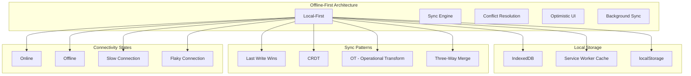
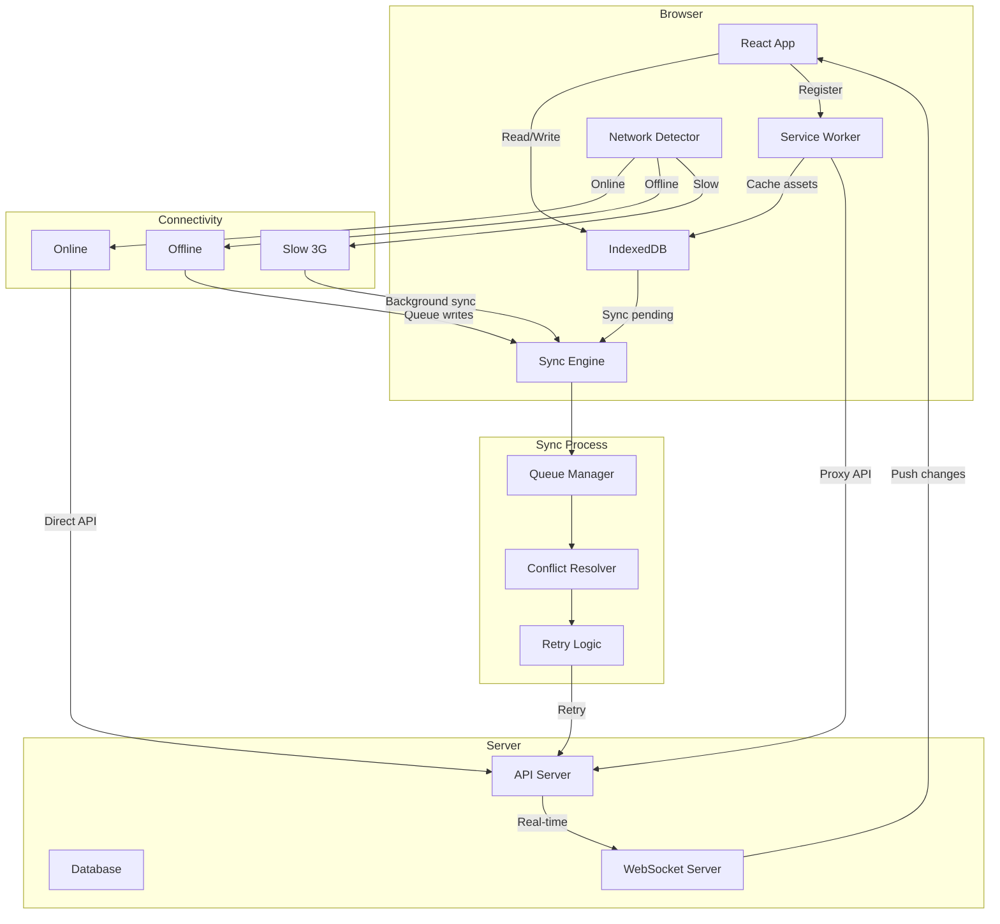

# Offline-First Architecture

Offline-first is an approach where applications are designed to work without a network connection, synchronizing data when connectivity is restored.

## Offline-First Principles



## Service Worker Caching Strategies

### Cache-First (Static Assets)

```javascript
// service-worker.js
const CACHE_NAME = 'app-v1';
const STATIC_ASSETS = [
  '/',
  '/index.html',
  '/assets/main.[hash].js',
  '/assets/main.[hash].css',
  '/assets/vendor.[hash].js',
  '/assets/logo.svg',
];

self.addEventListener('install', (event) => {
  event.waitUntil(
    caches.open(CACHE_NAME).then((cache) => {
      return cache.addAll(STATIC_ASSETS);
    })
  );
  self.skipWaiting(); // Activate immediately
});

self.addEventListener('activate', (event) => {
  event.waitUntil(
    caches.keys().then((keys) => {
      return Promise.all(
        keys
          .filter((key) => key !== CACHE_NAME)
          .map((key) => caches.delete(key))
      );
    })
  );
  self.clients.claim();
});

// Cache-first for static assets
self.addEventListener('fetch', (event) => {
  if (event.request.url.includes('/assets/')) {
    event.respondWith(
      caches.match(event.request).then((cached) => {
        return cached || fetch(event.request);
      })
    );
  }
});
```

### Network-First (API Calls)

```javascript
// Network-first for API
self.addEventListener('fetch', (event) => {
  if (event.request.url.includes('/api/')) {
    event.respondWith(
      fetch(event.request)
        .then((response) => {
          // Cache the latest response
          const clone = response.clone();
          caches.open(CACHE_NAME).then((cache) => {
            cache.put(event.request, clone);
          });
          return response;
        })
        .catch(() => {
          // Fall back to cache
          return caches.match(event.request);
        })
    );
  }
});
```

### Stale-While-Revalidate

```javascript
// Serve cached content, then update in background
self.addEventListener('fetch', (event) => {
  event.respondWith(
    caches.match(event.request).then((cached) => {
      const fetchPromise = fetch(event.request).then((response) => {
        caches.open(CACHE_NAME).then((cache) => {
          cache.put(event.request, response.clone());
        });
        return response;
      });

      return cached || fetchPromise;
    })
  );
});
```

## IndexedDB for Offline Data

```javascript
// src/services/offline-db.ts
import { openDB, IDBPDatabase } from 'idb';

class OfflineDB {
  private db: IDBPDatabase;

  async init() {
    this.db = await openDB('app-offline', 1, {
      upgrade(db) {
        // Create object stores
        if (!db.objectStoreNames.contains('todos')) {
          const store = db.createObjectStore('todos', { keyPath: 'id' });
          store.createIndex('status', 'status');
          store.createIndex('updatedAt', 'updatedAt');
        }
        
        if (!db.objectStoreNames.contains('sync-queue')) {
          const store = db.createObjectStore('sync-queue', {
            keyPath: 'id',
            autoIncrement: true,
          });
          store.createIndex('status', 'status');
        }

        if (!db.objectStoreNames.contains('users')) {
          db.createObjectStore('users', { keyPath: 'id' });
        }
      },
    });
  }

  async saveTodo(todo: Todo) {
    await this.db.put('todos', {
      ...todo,
      updatedAt: new Date().toISOString(),
      syncStatus: 'pending',
    });
  }

  async getTodos(): Promise<Todo[]> {
    return this.db.getAll('todos');
  }

  async getTodosByStatus(status: string): Promise<Todo[]> {
    return this.db.getAllFromIndex('todos', 'status', status);
  }

  async addToSyncQueue(operation: SyncOperation) {
    await this.db.add('sync-queue', {
      ...operation,
      status: 'pending',
      createdAt: new Date().toISOString(),
    });
  }

  async processSyncQueue() {
    const pending = await this.db.getAllFromIndex('sync-queue', 'status', 'pending');
    
    for (const operation of pending) {
      try {
        await this.executeSync(operation);
        await this.db.put('sync-queue', { ...operation, status: 'completed' });
      } catch (error) {
        await this.db.put('sync-queue', {
          ...operation,
          status: 'failed',
          error: error.message,
          retryCount: (operation.retryCount || 0) + 1,
        });
      }
    }
  }

  private async executeSync(operation: SyncOperation) {
    switch (operation.type) {
      case 'CREATE_TODO':
        return api.post('/todos', operation.data);
      case 'UPDATE_TODO':
        return api.put(`/todos/${operation.data.id}`, operation.data);
      case 'DELETE_TODO':
        return api.delete(`/todos/${operation.data.id}`);
    }
  }
}

export const offlineDB = new OfflineDB();
```

## Conflict Resolution

```javascript
// CRDT-like conflict resolution
class ConflictResolver {
  // Last Write Wins (LWW) - simple but can lose data
  resolveLWW(local, remote) {
    return new Date(local.updatedAt) > new Date(remote.updatedAt)
      ? local
      : remote;
  }

  // Three-way merge
  resolveThreeWay(base, local, remote) {
    const localChanges = this.diff(base, local);
    const remoteChanges = this.diff(base, remote);
    
    // No conflicts
    if (!this.hasConflict(localChanges, remoteChanges)) {
      return { ...base, ...localChanges, ...remoteChanges };
    }
    
    // Conflicts: auto-merge or mark
    return this.autoMerge(localChanges, remoteChanges, base);
  }

  // Field-level resolution for text fields
  resolveField(field, localValue, remoteValue) {
    // If one side didn't change, use the other
    if (localValue === remoteValue) return localValue;
    
    // For text: concatenate with marker
    return `${localValue}\n\n[Conflict: review this section]\n\n${remoteValue}`;
  }

  // Track changes between two objects
  private diff(base, current) {
    const changes = {};
    for (const key of Object.keys(current)) {
      if (current[key] !== base[key]) {
        changes[key] = current[key];
      }
    }
    return changes;
  }

  private hasConflict(localChanges, remoteChanges) {
    const localKeys = Object.keys(localChanges);
    const remoteKeys = Object.keys(remoteChanges);
    return localKeys.some(key => remoteKeys.includes(key));
  }
}
```

## Optimistic UI with Rollback

```javascript
// src/hooks/useOptimisticTodo.ts
function useOptimisticTodo() {
  const queryClient = useQueryClient();

  const deleteTodo = useMutation({
    mutationFn: (todoId: string) => api.delete(`/todos/${todoId}`),

    onMutate: async (todoId) => {
      await queryClient.cancelQueries(['todos']);
      const previous = queryClient.getQueryData(['todos']);

      queryClient.setQueryData(['todos'], (old: Todo[]) =>
        old.filter((todo) => todo.id !== todoId)
      );

      return { previous };
    },

    onError: (error, todoId, context) => {
      // Rollback to previous state
      queryClient.setQueryData(['todos'], context.previous);
      showToast('Failed to delete todo', { type: 'error' });
    },

    onSettled: () => {
      queryClient.invalidateQueries(['todos']);
    },
  });

  const addTodo = useMutation({
    mutationFn: (todo: Omit<Todo, 'id'>) => api.post('/todos', todo),

    onMutate: async (todo) => {
      await queryClient.cancelQueries(['todos']);
      const previous = queryClient.getQueryData(['todos']);

      const optimisticTodo: Todo = {
        ...todo,
        id: `temp-${Date.now()}`,
        createdAt: new Date().toISOString(),
        syncStatus: 'pending',
      };

      queryClient.setQueryData(['todos'], (old: Todo[]) =>
        old ? [...old, optimisticTodo] : [optimisticTodo]
      );

      return { previous, optimisticId: optimisticTodo.id };
    },

    onSuccess: (result, variables, context) => {
      // Replace optimistic todo with server response
      queryClient.setQueryData(['todos'], (old: Todo[]) =>
        old.map((todo) =>
          todo.id === context.optimisticId ? { ...result, syncStatus: 'synced' } : todo
        )
      );
    },

    onError: (error, variables, context) => {
      queryClient.setQueryData(['todos'], context.previous);
      showToast('Failed to create todo');
    },
  });

  return { deleteTodo, addTodo };
}
```

## Offline-First Architecture Diagram



## PWA Manifest

```json
{
  "manifest.json": {
    "name": "Offline First App",
    "short_name": "OfflineApp",
    "description": "Works offline with full data sync",
    "start_url": "/",
    "display": "standalone",
    "background_color": "#ffffff",
    "theme_color": "#6366f1",
    "icons": [
      { "src": "/icons/icon-192.png", "type": "image/png", "sizes": "192x192" },
      { "src": "/icons/icon-512.png", "type": "image/png", "sizes": "512x512" }
    ],
    "categories": ["productivity", "utilities"],
    "lang": "en-US",
    "orientation": "any",
    "scope": "/",
    "serviceworker": {
      "src": "/service-worker.js",
      "scope": "/"
    }
  }
}
```

## Resources
- [Service Worker API](https://developer.mozilla.org/en-US/docs/Web/API/Service_Worker_API)
- [IndexedDB with idb](https://github.com/jakearchibald/idb)
- [Workbox (Service Worker Libraries)](https://developer.chrome.com/docs/workbox/)
- [Offline Cookbook (Jake Archibald)](https://web.dev/offline-cookbook/)
- [CRDT - Conflict-Free Replicated Data Types](https://crdt.tech/)
