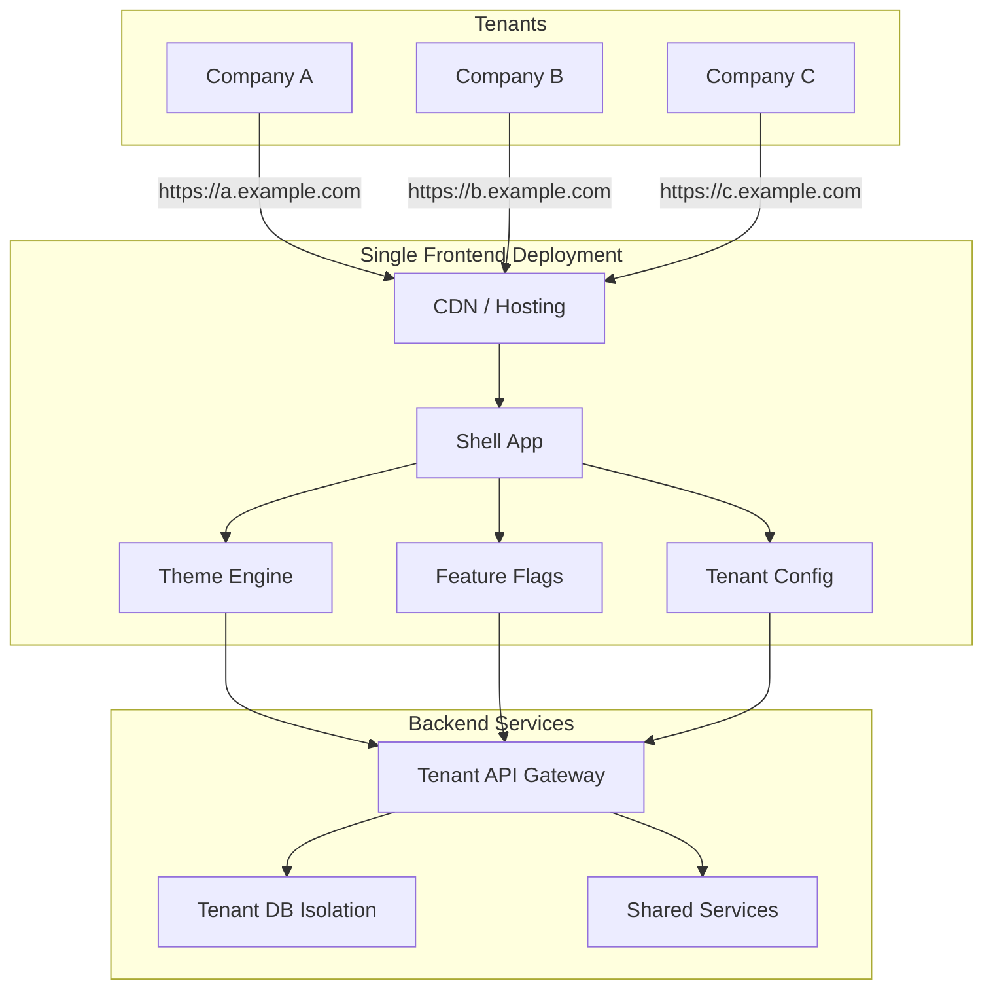
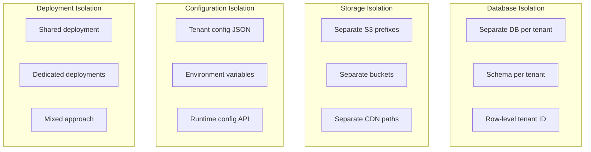
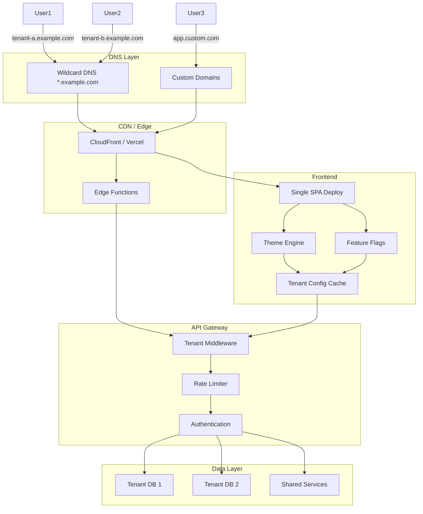

# Multi-Tenant Frontend Architecture

Multi-tenant applications serve multiple customers (tenants) from a single codebase, with each tenant having isolated configurations, branding, and data.

## Architecture Overview



## Tenant Resolution

```javascript
// src/services/tenant.ts
interface TenantConfig {
  id: string;
  name: string;
  domain: string;
  logo: string;
  primaryColor: string;
  features: FeatureFlag[];
  apiEndpoint: string;
  locale: string;
  timezone: string;
}

// Resolve tenant from hostname
async function resolveTenant(): Promise<TenantConfig> {
  const hostname = window.location.hostname;

  // Check subdomain-based routing
  // e.g., company-a.example.com, company-b.example.com
  const subdomain = hostname.split('.')[0];

  // Custom domain mapping
  // e.g., app.company-a.com maps to tenant_a
  const tenantMap = {
    'company-a.example.com': 'tenant_a',
    'company-b.example.com': 'tenant_b',
    'app.company-a.com': 'tenant_a',
    'app.company-b.com': 'tenant_b',
  };

  const tenantId = tenantMap[hostname] || subdomain;

  if (!tenantId) {
    throw new Error('Tenant not found');
  }

  // Fetch tenant configuration
  const response = await fetch(`/api/tenants/${tenantId}`);
  return response.json();
}

// Cache tenant config
let tenantConfig: TenantConfig | null = null;

export async function getTenant(): Promise<TenantConfig> {
  if (tenantConfig) return tenantConfig;
  
  tenantConfig = await resolveTenant();
  return tenantConfig;
}
```

## White-Labeling / Theming

```javascript
// src/services/theme.ts
class ThemeEngine {
  private tenant: TenantConfig;

  constructor(tenant: TenantConfig) {
    this.tenant = tenant;
  }

  // Generate CSS custom properties
  generateVariables(): Record<string, string> {
    return {
      '--color-primary': this.tenant.primaryColor,
      '--color-primary-light': this.lighten(this.tenant.primaryColor, 20),
      '--color-primary-dark': this.darken(this.tenant.primaryColor, 20),
      '--color-bg': this.tenant.theme?.backgroundColor || '#ffffff',
      '--color-text': this.tenant.theme?.textColor || '#111827',
      '--font-family': this.tenant.theme?.fontFamily || 'Inter, sans-serif',
      '--border-radius': this.tenant.theme?.borderRadius || '8px',
      '--logo-url': `url(${this.tenant.logo})`,
    };
  }

  // Apply theme to document
  applyTheme() {
    const vars = this.generateVariables();
    const root = document.documentElement;
    
    Object.entries(vars).forEach(([key, value]) => {
      root.style.setProperty(key, value);
    });

    // Set meta theme-color
    const meta = document.querySelector('meta[name="theme-color"]');
    if (meta) {
      meta.setAttribute('content', this.tenant.primaryColor);
    }

    // Update favicon
    const favicon = document.querySelector('link[rel="icon"]');
    if (favicon && this.tenant.favicon) {
      favicon.setAttribute('href', this.tenant.favicon);
    }

    // Set title prefix
    document.title = `${this.tenant.name} - Dashboard`;
  }

  private lighten(hex: string, percent: number): string {
    // Color manipulation logic
    return hex;
  }

  private darken(hex: string, percent: number): string {
    return hex;
  }
}
```

```css
/* Use CSS variables for theming */
:root {
  --color-primary: #6366f1; /* Default fallback */
  --color-bg: #ffffff;
  --color-text: #111827;
  --font-family: 'Inter', sans-serif;
  --border-radius: 8px;
}

.button {
  background-color: var(--color-primary);
  border-radius: var(--border-radius);
  font-family: var(--font-family);
}

.sidebar {
  background-color: var(--color-bg);
  color: var(--color-text);
}

.logo {
  background-image: var(--logo-url);
}
```

## Feature Flags per Tenant

```javascript
// src/services/feature-flags.ts
interface FeatureFlag {
  key: string;
  enabled: boolean;
  config?: Record<string, any>;
}

class FeatureFlagService {
  private flags: Map<string, FeatureFlag> = new Map();

  async init(tenantId: string) {
    const response = await fetch(`/api/tenants/${tenantId}/features`);
    const flags: FeatureFlag[] = await response.json();
    
    flags.forEach((flag) => this.flags.set(flag.key, flag));
  }

  isEnabled(key: string): boolean {
    return this.flags.get(key)?.enabled ?? false;
  }

  getConfig(key: string): Record<string, any> | null {
    return this.flags.get(key)?.config ?? null;
  }
}

// Usage
function Dashboard() {
  const flags = useFeatureFlags();

  return (
    <div>
      {/* New analytics feature only for tenants with the flag */}
      {flags.isEnabled('advanced-analytics') && <AdvancedAnalytics />}
      
      {/* Conditional rendering based on config */}
      {flags.isEnabled('custom-export') && (
        <ExportButton format={flags.getConfig('custom-export')?.defaultFormat} />
      )}
      
      {/* A/B test per tenant */}
      {flags.isEnabled('new-layout') ? <NewLayout /> : <LegacyLayout />}
    </div>
  );
}
```

## Dynamic Routing

```javascript
// src/router.tsx
import { createBrowserRouter } from 'react-router-dom';

async function createTenantRouter() {
  const tenant = await getTenant();
  
  return createBrowserRouter([
    {
      path: '/',
      element: <TenantLayout tenant={tenant} />,
      children: [
        {
          index: true,
          element: <Dashboard />,
        },
        // Tenant-specific routes
        ...tenant.features.map(feature => 
          feature.route ? {
            path: feature.route.path,
            element: feature.route.element,
          } : null
        ).filter(Boolean),
        {
          path: 'settings',
          element: <Settings />,
          loader: () => loadSettings(tenant.id),
        },
        {
          path: 'analytics',
          element: tenant.features.includes('analytics') 
            ? <Analytics />
            : <Navigate to="/" />,
        },
      ],
    },
  ]);
}
```

## API Integration with Tenant Context

```javascript
// src/api/client.ts
class TenantAwareApiClient {
  private tenant: TenantConfig;

  constructor(tenant: TenantConfig) {
    this.tenant = tenant;
  }

  async request<T>(path: string, options?: RequestOptions): Promise<T> {
    const url = `${this.tenant.apiEndpoint}${path}`;

    // Always include tenant context
    const headers = {
      'X-Tenant-ID': this.tenant.id,
      'X-Timezone': this.tenant.timezone,
      'X-Locale': this.tenant.locale,
      ...options?.headers,
    };

    return fetch(url, {
      ...options,
      headers,
      credentials: 'include',
    }).then(res => res.json());
  }
}
```

## Tenant Isolation Strategies



## Multi-Tenant UI Components

```jsx
// Tenant-aware component
function BrandedHeader() {
  const { tenant } = useTenant();
  
  return (
    <header style={{ backgroundColor: tenant.primaryColor }}>
      
      <h1>{tenant.name}</h1>
      {tenant.showSupportChat && <ChatWidget />}
    </header>
  );
}

// Tenant-conditional navigation
function Sidebar() {
  const { tenant } = useTenant();
  
  const menuItems = [
    { icon: Home, label: 'Dashboard', path: '/' },
    { icon: Settings, label: 'Settings', path: '/settings' },
    // Tenant-specific menu items
    ...tenant.customMenuItems?.map(item => ({
      icon: item.icon,
      label: item.label,
      path: item.path,
    })) || [],
  ];
  
  // Only show if tenant has analytics feature
  if (tenant.features.includes('analytics')) {
    menuItems.push({ icon: Chart, label: 'Analytics', path: '/analytics' });
  }
  
  return (
    <nav>
      {menuItems.map(item => (
        <NavLink key={item.path} to={item.path}>
          <item.icon />
          <span>{item.label}</span>
        </NavLink>
      ))}
    </nav>
  );
}
```

## Tenant Configuration Example

```json
{
  "id": "tenant_a",
  "name": "Acme Corp",
  "domain": "app.acme.com",
  "logo": "/logos/acme.svg",
  "favicon": "/favicons/acme.ico",
  "primaryColor": "#2563eb",
  "secondaryColor": "#7c3aed",
  "theme": {
    "backgroundColor": "#f8fafc",
    "textColor": "#1e293b",
    "fontFamily": "Inter, sans-serif",
    "borderRadius": "6px",
    "darkMode": true
  },
  "locale": "en-US",
  "timezone": "America/New_York",
  "features": [
    "analytics",
    "export-csv",
    "team-management",
    "audit-logs"
  ],
  "customMenuItems": [
    {
      "icon": "inventory",
      "label": "Inventory",
      "path": "/inventory"
    }
  ],
  "limits": {
    "maxUsers": 50,
    "storageGB": 100,
    "apiRateLimit": 1000
  }
}
```

## Multi-Tenant Architecture Diagram



## Resources
- [Multi-Tenant Architecture Patterns](https://docs.microsoft.com/en-us/azure/architecture/guide/multitenant/overview)
- [Feature Flags with LaunchDarkly](https://launchdarkly.com/)
- [White-Labeling Strategies](https://www.smashingmagazine.com/2020/11/white-label-website-design-strategies/)
- [Tenant Isolation in SaaS](https://www.mongodb.com/blog/post/multi-tenant-data-isolation-with-mongodb)
