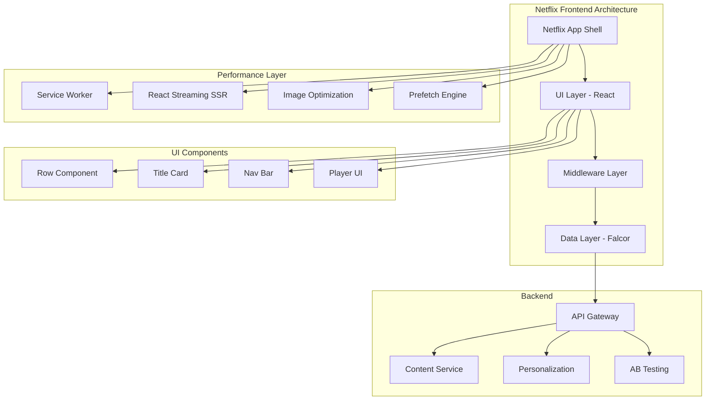
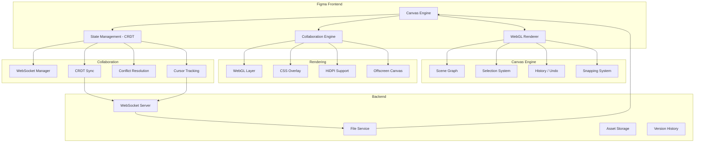
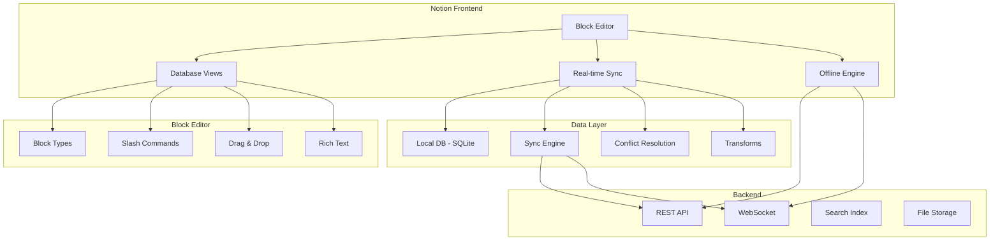
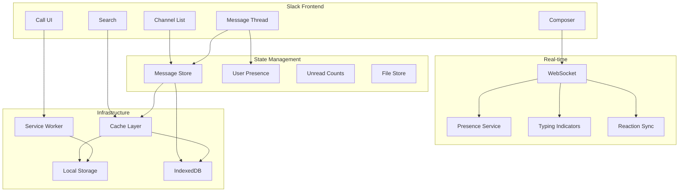
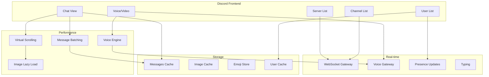

# Frontend System Design Case Studies

Analysis of how major applications architect their frontend systems.

## 1. Netflix

### Architecture

### Key Design Decisions

| Aspect | Decision | Why |
|--------|----------|-----|
| UI Framework | React | Component reusability, performance |
| Data Layer | Falcor (Graph-like) | Efficient data fetching, reduce over-fetching |
| Rendering | React Streaming SSR | Faster time-to-first-byte on slow connections |
| Image optimization | Custom service | Responsive images, WebP/AVIF, progressive loading |
| State management | Local component state | Minimizing complexity, Netflix UI is mostly server-driven |
| Platform | Cross-platform via React | Android, iOS, Web shared components |

### Challenges Solved

- **Global scale:** Serving 200M+ subscribers across 190 countries
- **Slow networks:** Progressive loading, streaming SSR, optimized images
- **Personalization:** Server-driven UI based on viewing history
- **AB Testing:** Thousands of concurrent experiments
- **Cross-platform:** React Native for mobile, React for web

### Key Takeaway
Netflix treats the frontend as a thin orchestration layer over server-driven data. The Falcor data layer eliminates N+1 queries and over-fetching.

---

## 2. Figma

### Architecture

### Key Design Decisions

| Aspect | Decision | Why |
|--------|----------|-----|
| Rendering | WebGL (custom engine) | Smooth 60fps canvas rendering |
| State sync | CRDT (Conflict-free Replicated Data Types) | Offline edits, no central server |
| Programming | C++ compiled to WASM | High-performance for critical path |
| Collaboration | Custom WebSocket protocol | Real-time cursor, edit sync |
| Architecture | Monorepo | Shared types, easy refactoring |

### Challenges Solved

- **Real-time collaboration:** Multiple users editing simultaneously
- **Performance:** Smooth rendering of complex designs
- **Memory management:** Handling large files (1000s of layers)
- **Undo/redo:** History management across collaborative sessions
- **Offline support:** Local edits sync when online

### Key Takeaway
Figma uses CRDT for conflict-free collaboration and WebAssembly for performance-critical rendering. The frontend is as sophisticated as any desktop design tool.

---

## 3. Notion

### Architecture

### Key Design Decisions

| Aspect | Decision | Why |
|--------|----------|-----|
| Document model | Block-based editor | Flexible nesting, custom types |
| Local state | SQLite via WASM | Full local database, offline support |
| Sync | Custom sync protocol | Delta-based, conflict resolution |
| Frontend | React | Component system for block types |
| Platform | Electron + Web | Shared code across desktop & web |
| Data structure | Custom JSON block tree | Simple, flexible, versionable |

### Challenges Solved

- **Offline-first:** Full local copy of all data
- **Collaboration:** Real-time editing with conflict resolution
- **Complex documents:** Nested blocks, databases, formulas
- **Performance:** Lazy loading of page content
- **Search:** Local full-text search across all content

### Key Takeaway
Notion uses a local-first architecture with a custom sync engine. The block-based approach allows unlimited extensibility while maintaining a consistent editing experience.

---

## 4. Slack

### Architecture

### Key Design Decisions

| Aspect | Decision | Why |
|--------|----------|-----|
| State management | Custom store + Redux | Predictable state updates across huge state tree |
| Real-time | WebSocket with persistent connection | Instant message delivery |
| Search | Local + remote hybrid | Instant results + comprehensive search |
| Performance | Virtual scrolling in message list | Smooth scrolling through 1000s of messages |
| Offline | Service Worker + IndexedDB | Cached channels, send messages offline |

### Challenges Solved

- **Massive state:** 1000s of channels, millions of messages in DOM
- **Real-time correctness:** Message ordering, threading, reactions
- **Search performance:** Instant search across all workspaces
- **Memory management:** Virtual scrolling, message recycling
- **Cross-platform:** Desktop (Electron) + Web + Mobile

### Key Takeaway
Slack's virtual scrolling and incremental rendering enable performance at extreme scale. The offline queue allows message sending even without connectivity.

---

## 5. Discord

### Architecture

### Key Design Decisions

| Aspect | Decision | Why |
|--------|----------|-----|
| UI Framework | React | Large component ecosystem |
| Voice | WebRTC + custom engine | Low-latency voice communication |
| Real-time | WebSocket gateway | Persistent connection with zlib compression |
| Performance | Message windowing | Only render visible messages |
| State | Custom state management | Optimized for real-time updates |
| Image optimization | Discord CDN + lazy loading | Millions of images shared daily |

### Challenges Solved

- **Low-latency voice:** Sub-50ms voice communication
- **Message delivery:** Real-time with no ordering issues
- **Scalability:** Millions of concurrent voice users
- **Rich messages:** Embeds, reactions, threads, stickers
- **Upload performance:** Optimized image processing pipeline

### Key Takeaway
Discord combines WebRTC for real-time voice with WebSocket for chat. Message windowing and lazy loading keep the app responsive despite huge volumes of content.

---

## Comparison Table

| Aspect | Netflix | Figma | Notion | Slack | Discord |
|--------|---------|-------|--------|-------|---------|
| **UI Framework** | React | Custom (WebGL/WASM) | React | React | React |
| **State Management** | Component state + Falcor | CRDT + Local store | SQLite + Custom sync | Redux + Custom store | Custom |
| **Real-time** | SSE | WebSocket | WebSocket | WebSocket | WebSocket + WebRTC |
| **Data Strategy** | Server-driven (Falcor) | CRDT (P2P) | Local-first | Optimistic updates | Server-authoritative |
| **Rendering** | React SSR streaming | WebGL (Canvas) | DOM | DOM + Virtual scroll | DOM + Virtual scroll |
| **Performance** | Image optimization, prefetching | WebAssembly, Offscreen Canvas | Lazy loading, local DB | Windowed scrolling, IndexedDB | Message windowing, zlib compression |
| **Offline** | Limited | Full (WASM + IndexedDB) | Full (SQLite) | Queued messages | Limited |
| **Collaboration** | Shared watch parties | Full real-time editing | Real-time editing | Channels + threads | Voice + chat |
| **Key Innovation** | Falcor data layer | WASM rendering engine | Block editor + Local SQLite | Message store at scale | WebRTC voice |

## Common Patterns Across Case Studies

1. **Lazy loading** and code splitting for bundle size
2. **Virtual scrolling** for large lists/messages
3. **Optimistic updates** for perceived performance
4. **WebSocket** for real-time communication
5. **Service Workers** for caching and offline support
6. **CDN** for asset delivery
7. **Cross-platform** code sharing
8. **Custom performance monitoring**
9. **Feature flags** for gradual rollouts
10. **A/B testing** for data-driven decisions

## Resources
- [Netflix Tech Blog](https://netflixtechblog.com/)
- [Figma Engineering](https://www.figma.com/blog/engineering/)
- [Notion Engineering](https://www.notion.so/blog/topic/engineering)
- [Slack Engineering](https://slack.engineering/)
- [Discord Engineering](https://discord.com/category/engineering)
