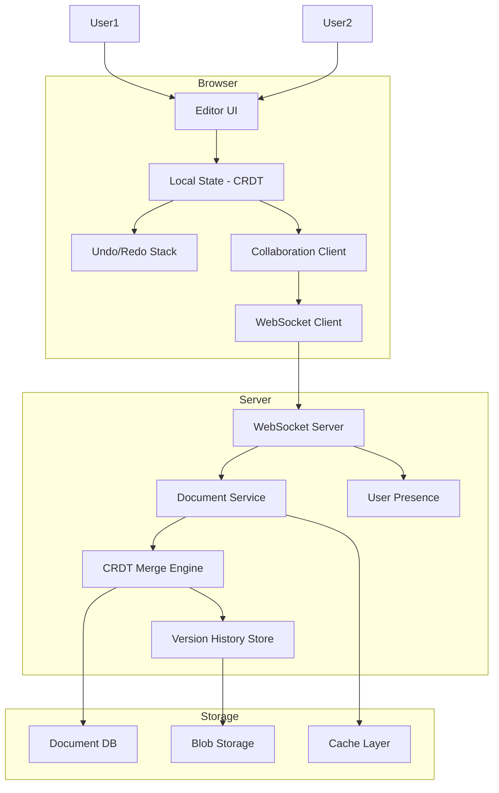
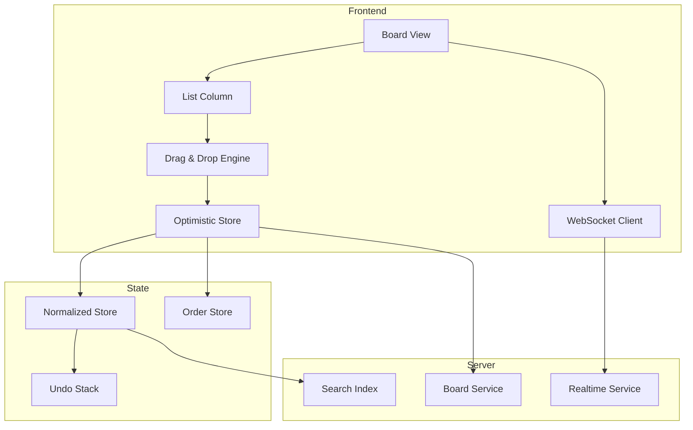
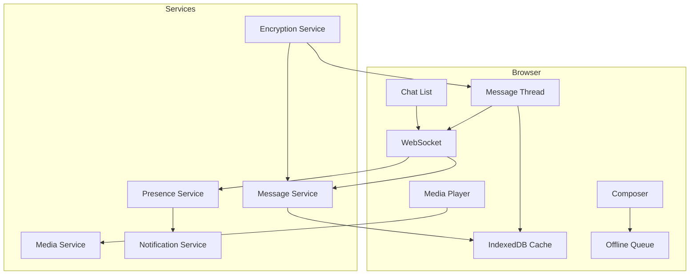
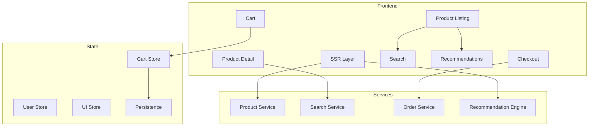
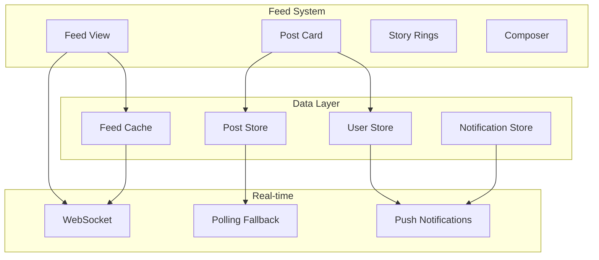
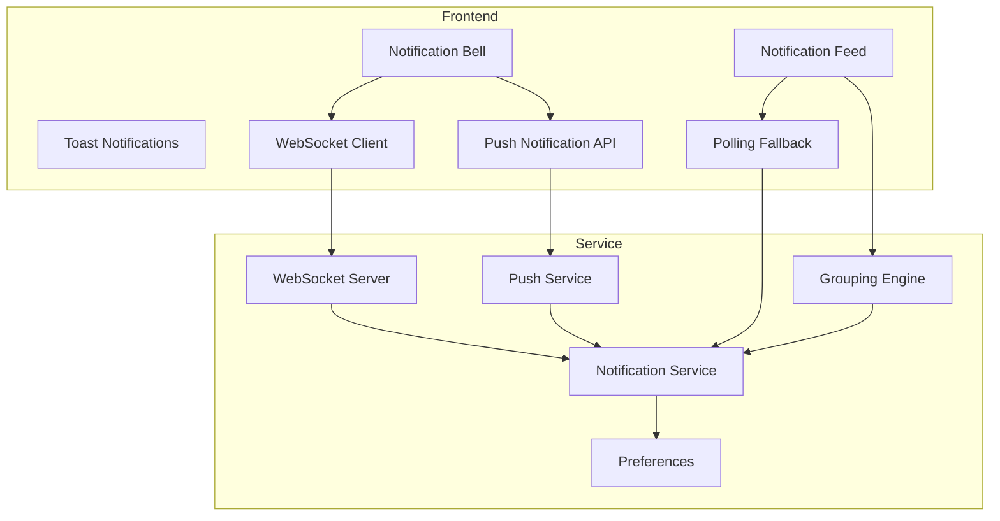

# Frontend System Design Questions

Structured answers to common frontend system design interview questions with functional/non-functional requirements, architecture, component trees, and data flow.

---

## Q1: Design Google Docs

### Requirements

**Functional:**
- Real-time collaborative document editing
- Rich text formatting (bold, italic, headings, lists)
- Comments and suggestions
- Version history (undo/redo)
- Export (PDF, Word)

**Non-functional:**
- < 100ms latency for own edits
- < 500ms latency for collaborative edits
- Offline support for reading
- Support 100+ concurrent editors
- 99.9% uptime

### Architecture



### Component Tree

```
Editor
├── Toolbar
│   ├── FormatButtons (Bold, Italic, Underline)
│   ├── HeadingSelect
│   ├── ListButtons
│   └── AlignmentButtons
├── DocumentBody
│   ├── PageHeader
│   ├── Paragraph[]
│   │   ├── TextRun (inline formatting)
│   │   ├── Image
│   │   └── Link
│   └── PageFooter
├── Sidebar
│   ├── CommentsPanel
│   │   ├── CommentThread[]
│   │   │   ├── Comment
│   │   │   └── Reply
│   └── VersionHistory
│       └── VersionEntry[]
├── CollaborationOverlay
│   ├── CursorOverlay (other users' cursors)
│   └── PresenceIndicator
└── StatusBar
    ├── WordCount
    ├── ConnectionStatus
    └── LastSaved
```

### Data Flow

```
1. User types character
   → Local CRDT state updated (instant)
   → Character broadcast via WebSocket
   → Server merges with other edits
   → Broadcast to other clients
   → Other clients apply CRDT transformation

2. Save
   → Debounced (every 500ms) version snapshot
   → Send diff to server
   → Server stores version
   → Update version history

3. Offline
   → Edits stored locally in IndexedDB
   → Queue of pending CRDT operations
   → On reconnect: replay queue, merge conflicts
```

---

## Q2: Design Trello / Kanban Board

### Requirements

**Functional:**
- Create/edit/delete boards, lists, cards
- Drag-and-drop cards between lists
- Card details (description, checklist, due dates, labels)
- Assign members to cards
- Activity log

**Non-functional:**
- Smooth drag and drop (60fps)
- Real-time updates across users
- Offline optimistic updates
- Load 1000+ cards in a board

### Architecture



### Component Tree

```
Board
├── BoardHeader
│   ├── BoardTitle
│   ├── StarButton
│   ├── VisibilitySelect
│   └── MenuButton
├── BoardContent
│   ├── List[]
│   │   ├── ListHeader
│   │   │   ├── ListTitle
│   │   │   ├── CardCount
│   │   │   └── ListMenu
│   │   ├── Card[]
│   │   │   ├── CardCover
│   │   │   ├── CardLabels
│   │   │   ├── CardTitle
│   │   │   ├── CardBadges
│   │   │   │   ├── DueDateBadge
│   │   │   │   ├── ChecklistBadge
│   │   │   │   └── CommentBadge
│   │   │   └── CardMembers
│   │   └── AddCardButton
│   └── AddListButton
└── CardDetail (Modal)
    ├── Description
    ├── Checklist[]
    ├── CommentSection
    ├── ActivityLog
    └── Sidebar
        ├── Members
        ├── Labels
        ├── DueDate
        └── MoveCard
```

### Data Flow

```
1. Drag card from List A to List B
   → Optimistic: move card in local store immediately
   → Send mutation to server
   → On success: confirm
   → On error: rollback to previous positions

2. Real-time updates
   → WebSocket connects on board open
   → Server pushes card moves, updates, new cards
   → Local store updated without full reload

3. Performance strategy
   → Virtual scrolling if > 100 cards per list
   → Lazy load card details (modal loads on demand)
   → Normalized store (cards, lists, boards separate)
```

---

## Q3: Design a Chat Application (WhatsApp Web)

### Requirements

**Functional:**
- One-on-one and group chats
- Send text, images, voice messages, files
- Read receipts, typing indicators
- Message search
- Push notifications

**Non-functional:**
- Real-time message delivery
- Offline message queue
- Handle 10,000+ messages per chat
- End-to-end encryption
- Efficient message pagination

### Architecture



### Component Tree

```
ChatApp
├── Sidebar
│   ├── SearchBar
│   ├── ChatList
│   │   ├── ChatListItem[]
│   │   │   ├── Avatar
│   │   │   ├── ChatName
│   │   │   ├── LastMessage
│   │   │   ├── Timestamp
│   │   │   └── UnreadBadge
│   └── NewChatButton
└── MainPanel
    ├── ChatHeader
    │   ├── ChatInfo
    │   ├── SearchMessages
    │   └── ChatMenu
    ├── MessageList
    │   ├── DateDivider
    │   ├── Message[]
    │   │   ├── SentMessage
    │   │   ├── ReceivedMessage
    │   │   ├── ImageMessage
    │   │   ├── VoiceMessage
    │   │   ├── FileMessage
    │   │   └── SystemMessage
    │   └── LoadMore (infinite scroll up)
    └── Composer
        ├── AttachmentButton
        ├── EmojiPicker
        ├── TextInput
        ├── VoiceRecordButton
        └── SendButton
```

### Data Flow

```
1. Send message
   → Encrypt message locally
   → Store optimistic message in IndexedDB
   → Display immediately (optimistic)
   → Send encrypted message via WebSocket
   → Server decrypts, delivers, broadcasts
   → Read receipt received → update message status

2. Load chat history
   → Load from IndexedDB first (instant)
   → Fetch paginated messages from server
   → Merge with local cache
   → Infinite scroll up for older messages

3. Offline handling
   → Queue outgoing messages in IndexedDB
   → Show with "pending" status
   → On reconnect: send queued messages
   → On success: update status to "sent"
```

---

## Q4: Design a Video Streaming UI (YouTube/Netflix)

### Requirements

**Functional:**
- Video player with controls
- Content recommendations
- Search with autocomplete
- User profiles and watch history
- Comments and likes

**Non-functional:**
- < 2s startup time
- Adaptive bitrate streaming
- Smooth 60fps playback
- 4K support
- Cross-device resume
- Global CDN delivery

### Component Tree

```
VideoApp
├── Header
│   ├── Logo
│   ├── SearchBar (with autocomplete)
│   ├── Notifications
│   └── UserMenu
├── Content
│   ├── VideoPlayer
│   │   ├── VideoElement
│   │   ├── ControlsOverlay
│   │   │   ├── PlayPause
│   │   │   ├── Timeline
│   │   │   ├── VolumeControl
│   │   │   ├── QualitySelector
│   │   │   ├── Subtitles
│   │   │   ├── FullscreenButton
│   │   │   └── PictureInPicture
│   │   ├── SponsoredOverlay
│   │   └── EndScreen
│   └── VideoMeta
│       ├── Title
│       ├── ChannelInfo
│       │   ├── Avatar
│       │   ├── ChannelName
│       │   └── SubscribeButton
│       ├── Actions
│       │   ├── LikeButton
│       │   ├── ShareButton
│       │   └── SaveButton
│       ├── Description
│       ├── CommentSection
│       │   ├── CommentSort
│       │   ├── CommentComposer
│       │   └── Comment[]
│       └── RecommendedVideos
│           └── VideoCard[]
└── Sidebar
    └── Recommendations
        └── VideoCard[]
```

### Data Flow

```
1. Play video
   → Request manifest (.m3u8 for HLS)
   → Start lowest quality segment
   → Monitor bandwidth
   → Upgrade/downgrade quality adaptively
   → Pre-fetch next segments

2. Search
   → Debounced input (300ms)
   → API call for autocomplete suggestions
   → On submit: search results page
   → Infinite scroll for more results

3. Recommendations
   → Loaded on page mount
   → Personalized based on history
   → Scrollable horizontal list
   → Lazy load thumbnails
```

---

## Q5: Design an E-Commerce Platform (Amazon)

### Requirements

**Functional:**
- Product listing with filters
- Product detail page
- Shopping cart
- Checkout flow
- Order history
- Reviews and ratings

**Non-functional:**
- Handle millions of products
- < 2s page load
- Search latency < 100ms
- Cart persistence across sessions
- Mobile responsive

### Architecture



### Component Tree

```
HomePage
├── Header
│   ├── Logo
│   ├── SearchBar
│   ├── CartWidget
│   └── UserMenu
├── Categories
│   └── CategoryNav
├── Carousel
│   └── HeroBanner[]
├── Recommendations
│   └── ProductCard[]
├── ProductGrid
│   └── ProductCard[]
│       ├── ProductImage
│       ├── ProductTitle
│       ├── Rating
│       ├── Price
│       └── AddToCart
└── Footer

ProductDetailPage
├── Breadcrumbs
├── ImageGallery
├── ProductInfo
│   ├── Title
│   ├── Rating
│   ├── Price
│   ├── Variants (size, color)
│   ├── Description
│   └── AddToCart / BuyNow
├── Reviews
│   ├── ReviewSummary
│   └── Review[]
└── RelatedProducts

CheckoutFlow
├── CartReview
├── ShippingAddress
├── PaymentMethod
├── OrderSummary
└── Confirmation
```

### Data Flow

```
1. Browse products
   → SSR renders initial product list
   → Client hydrates with React
   → Filters trigger API calls
   → URL updates for shareable state
   → Infinite scroll for more results

2. Add to cart
   → Optimistic: add to local cart store
   → Sync to server cart
   → Cart persisted in localStorage
   → Recovered on next visit

3. Checkout
   → Multi-step form
   → Validate each step before proceeding
   → Order submission with idempotency key
   → Redirect to confirmation
```

---

## Q6: Design a Social Media Feed (Twitter/Instagram)

### Requirements

**Functional:**
- Infinite scrolling feed
- Post creation with images/video
- Like, comment, share
- Follow/unfollow users
- Notifications

**Non-functional:**
- Load feed in < 1s
- Handle 1000s of posts
- Real-time like/comment updates
- Optimistic UI for interactions
- Graceful loading states

### Architecture



### Component Tree

```
Feed
├── StoriesBar
│   └── StoryCircle[]
├── CreatePost (composer)
├── Post[]
│   ├── PostHeader
│   │   ├── Avatar
│   │   ├── Username
│   │   └── Timestamp
│   ├── PostImage (carousel)
│   ├── PostActions
│   │   ├── LikeButton
│   │   ├── CommentButton
│   │   └── ShareButton
│   ├── LikeCount
│   ├── Caption
│   │   ├── UserMention
│   │   └── Hashtag
│   ├── CommentPreview[]
│   └── CommentComposer
├── LoadMore (infinite scroll)
└── LoadingSkeleton
```

### Data Flow

```
1. Load feed
   → Show skeleton while loading
   → Fetch 10 posts initially
   → Cache in IndexedDB for offline
   → Infinite scroll: fetch next page
   → New posts inserted at top via WebSocket

2. Like a post
   → Optimistic: increment count, highlight heart
   → Send API request
   → On error: rollback
   → Real-time: broadcast to other viewers

3. Create post
   → Upload image/video (background)
   → Optimistic: show in feed immediately
   → On complete: replace placeholder with real post
```

---

## Q7: Design a Dashboard / Analytics Platform

### Requirements

**Functional:**
- Multiple chart types (line, bar, pie, table)
- Date range filtering
- Data export (CSV, PDF)
- Customizable widgets
- Real-time data refresh

**Non-functional:**
- Handle 100K+ data points
- Smooth chart animations
- < 500ms interaction response
- Lazy load heavy widgets
- Responsive layout

### Architecture

```mermaid
graph TB
    subgraph "Dashboard"
        A[Widget Grid]
        B[Chart Components]
        C[Data Table]
        D[Filter Bar]
        E[Export Service]
    end
    
    subgraph "Data Layer"
        F[Query Engine]
        G[Aggregation Cache]
        H[Real-time Stream]
        I[CSV Generator]
    end
    
    subgraph "Charts"
        J[Canvas Renderer]
        K[SVG Renderer]
        L[WebGL (large data)]
    end
    
    A --> B
    A --> C
    A --> D
    
    B --> J
    B --> K
    B --> L
    
    D --> F
    F --> G
    F --> H
    
    E --> I
    C --> E
    B --> D
```

### Component Tree

```
Dashboard
├── FilterBar
│   ├── DateRangePicker
│   ├── DropdownFilter[]
│   ├── RefreshButton
│   └── AutoRefreshToggle
├── WidgetGrid
│   ├── Widget[]
│   │   ├── WidgetHeader
│   │   │   ├── WidgetTitle
│   │   │   ├── MenuButton (remove, resize, export)
│   │   │   └── LastUpdated
│   │   ├── WidgetContent
│   │   │   ├── LineChart
│   │   │   ├── BarChart
│   │   │   ├── PieChart
│   │   │   ├── DataTable
│   │   │   ├── MetricCard
│   │   │   │   ├── MetricValue
│   │   │   │   ├── TrendIndicator
│   │   │   │   └── Sparkline
│   │   │   └── GeoMap
│   │   └── WidgetFooter
│   └── AddWidgetButton
└── ExportMenu
```

### Data Flow

```
1. Load dashboard
   → Fetch widget configuration
   → Parallel data queries for each widget
   → Show skeleton per widget
   → Data arrives → render chart
   → Cache results for 60 seconds

2. Date range change
   → Update URL params (shareable)
   → Re-fetch data for all widgets
   → Animate chart transitions
   → Cache new results

3. Real-time metrics
   → WebSocket stream for live data
   → Update metric cards without re-rendering charts
   → Debounce chart updates (2s)
   → Show "live" indicator
```

---

## Q8: Design a Music Streaming App (Spotify)

### Requirements

**Functional:**
- Music playback with controls
- Playlist management
- Search for songs/albums/artists
- Recommendations
- Offline downloads

**Non-functional:**
- Instant playback startup
- Gapless playback
- Cross-device sync
- Efficient audio streaming
- Handle 50M+ songs catalog

### Component Tree

```
MusicApp
├── Sidebar
│   ├── Logo
│   ├── MainNav
│   │   ├── Home
│   │   ├── Search
│   │   └── Library
│   ├── Playlists
│   │   └── PlaylistItem[]
│   └── CreatePlaylistButton
├── MainContent
│   ├── HomePage
│   │   ├── RecentlyPlayed
│   │   ├── MadeForYou
│   │   └── PopularPlaylists
│   ├── SearchPage
│   │   ├── SearchInput
│   │   ├── TopResults
│   │   ├── Songs
│   │   ├── Artists
│   │   └── Albums
│   ├── PlaylistPage
│   │   ├── PlaylistHeader
│   │   │   ├── PlaylistImage
│   │   │   ├── PlaylistInfo
│   │   │   └── PlayButtons
│   │   └── TrackList
│   │       └── TrackItem[]
│   └── AlbumPage
│       ├── AlbumHeader
│       └── TrackList
└── NowPlayingBar
    ├── TrackInfo
    │   ├── AlbumArt
    │   ├── TrackName
    │   └── ArtistName
    ├── PlaybackControls
    │   ├── ShuffleButton
    │   ├── PreviousButton
    │   ├── PlayPauseButton
    │   ├── NextButton
    │   └── RepeatButton
    ├── ProgressBar
    ├── VolumeControl
    └── ExtraControls
        ├── QueueButton
        ├── DeviceButton
        └── LyricsButton
```

### Data Flow

```
1. Play a song
   → Request audio stream URL from server
   → Start streaming (adaptive bitrate)
   → Cache audio chunks in IndexedDB
   → Pre-fetch next song in playlist
   → Update "Now Playing" state
   → Broadcast to device management

2. Search
   → Debounced search query
   → Search songs, artists, albums, playlists
   → Categorize results
   → Show recent searches

3. Offline sync
   → User marks playlist for offline
   → Download all tracks in background
   → Store encrypted in IndexedDB
   → Show download progress per track
```

---

## Q9: Design a Form Builder (Typeform/Google Forms)

### Requirements

**Functional:**
- Drag-and-drop form builder
- Multiple question types (text, multiple choice, rating, file upload)
- Conditional logic/skip logic
- Response collection and analytics
- Theme customization

**Non-functional:**
- Smooth drag and drop
- Real-time collaboration on builder
- Handle 100+ questions
- Auto-save drafts
- Responsive preview

### Component Tree

```
FormBuilder
├── BuilderToolbar
│   ├── AddQuestionButton
│   ├── ThemeSelector
│   ├── SettingsButton
│   ├── PreviewButton
│   └── PublishButton
├── BuilderCanvas
│   ├── Question[]
│   │   ├── QuestionHeader
│   │   │   ├── DragHandle
│   │   │   ├── QuestionTypeIcon
│   │   │   ├── QuestionInput
│   │   │   └── QuestionMenu (duplicate, delete)
│   │   ├── QuestionBody
│   │   │   ├── ShortText
│   │   │   ├── LongText
│   │   │   ├── MultipleChoice
│   │   │   ├── Checkboxes
│   │   │   ├── Dropdown
│   │   │   ├── Rating
│   │   │   ├── DatePicker
│   │   │   ├── FileUpload
│   │   │   └── LinearScale
│   │   └── QuestionLogic
│   │       ├── ConditionalRules
│   │       └── SkipLogic
│   └── AddQuestionBlock
└── QuestionSidebar
    ├── QuestionSettings
    ├── ValidationRules
    └── LogicBuilder
```

### Data Flow

```
1. Add question
   → Insert into form schema at position
   → Focus on new question
   → Auto-save draft (debounced, 1s)

2. Reorder questions
   → Drag and drop updates order array
   → Optimistic UI reorder
   → Sync to backend
   → Auto-save

3. Preview mode
   → Render form using response components
   → Same components as public form
   → Test conditional logic
   → Submit test response
```

---

## Q10: Design a Real-Time Notification System

### Requirements

**Functional:**
- Real-time notifications (like, comment, follow, mention)
- Notification feed with read/unread state
- Push notifications (when browser closed)
- Notification preferences per user
- Group similar notifications

**Non-functional:**
- < 100ms delivery
- Handle 1M+ notifications/day
- Persist notification history
- Graceful degradation (polling fallback)
- Mark all as read in bulk

### Architecture



### Component Tree

```
NotificationSystem
├── NotificationBell
│   ├── BellIcon
│   ├── UnreadBadge (count)
│   └── Dropdown
│       ├── NotificationItem[]
│       │   ├── NotificationIcon
│       │   ├── NotificationContent
│       │   │   ├── UserAvatar
│       │   │   ├── Message
│       │   │   └── Timestamp
│       │   └── NotificationActions
│       │       └── MarkReadButton
│       └── SeeAllButton
├── NotificationPage
│   ├── Filters
│   │   ├── All
│   │   ├── Unread
│   │   └── Types (likes, comments, follows)
│   ├── NotificationList
│   │   └── NotificationGroup[]
│   │       ├── GroupHeader ("Yesterday")
│   │       └── NotificationItem[]
│   └── MarkAllReadButton
└── ToastNotification (floating)
    ├── ToastContent
    └── AutoDismiss (5s)
```

### Data Flow

```
1. New notification arrives
   → WebSocket push from server
   → Show toast notification (5s)
   → Increment bell badge
   → Prepend to notification feed
   → If browser hidden: show push notification

2. Click notification
   → Mark as read
   → Navigate to source
   → Update badge count

3. Notification polling
   → If WebSocket disconnects
   → Poll every 30s
   → Sync missed notifications
   → Merge with existing feed
```

## Resources
- [Frontend System Design Interview Guide](https://www.greatfrontend.com/system-design)
- [Grokking the Frontend System Design Interview](https://www.designgurus.io/course/grokking-frontend-system-design)
- [Frontend System Design (YouTube)](https://www.youtube.com/playlist?list=PLA_lX9Q1vJfWwwF0IdUVdtVqDxVlFn75d)
