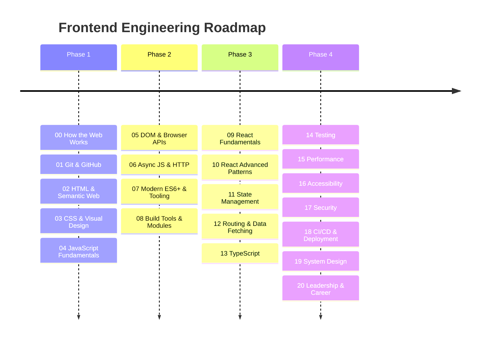

# 🗺️ Frontend Engineering Roadmap — Full Detailed Version

> **20 sections across 4 phases | ~12 months | 20+ projects**

---

## Phase Overview Diagram

```mermaid
graph TD
    subgraph "Phase 1: Foundation"
        S00["00: Getting Started: How the Web Works"]
        S01["01: Terminal, Git & GitHub"]
        S02["02: HTML & Semantic Web"]
        S03["03: CSS & Visual Design"]
        S04["04: JavaScript Fundamentals"]
    end
    
    subgraph "Phase 2: The Web"
        S05["05: DOM, Browser APIs & Events"]
        S06["06: Async JavaScript & HTTP"]
        S07["07: Modern ES6+ & Tooling"]
        S08["08: Build Tools & Module System"]
    end
    
    subgraph "Phase 3: Frameworks"
        S09["09: React Fundamentals"]
        S10["10: React Advanced Patterns"]
        S11["11: State Management"]
        S12["12: Routing & Data Fetching"]
        S13["13: TypeScript"]
    end
    
    subgraph "Phase 4: Production & Architecture"
        S14["14: Testing"]
        S15["15: Performance Optimization"]
        S16["16: Accessibility (a11y)"]
        S17["17: Security"]
        S18["18: CI/CD & Deployment"]
        S19["19: System Design & Architecture"]
        S20["20: Soft Skills, Leadership & Career"]
    end
    
    S00 --> S01 --> S02 --> S03 --> S04
    S04 --> S05 --> S06 --> S07 --> S08
    S08 --> S09 --> S10 --> S11 --> S12 --> S13
    S13 --> S14 --> S15 --> S16 --> S17 --> S18 --> S19 --> S20
    
    style S00 fill:#4a9eff,color:#fff
    style S04 fill:#4a9eff,color:#fff
    style S08 fill:#42d392,color:#fff
    style S13 fill:#f7df1e,color:#333
    style S20 fill:#ff6b6b,color:#fff
```



---

## Phase 1: Foundation (Sections 00-04)

```
 ╔══════════════════════════════════════════════════════════════╗
 ║                     PHASE 1: FOUNDATION                     ║
 ║                                                             ║
 ║   00 ──→ 01 ──→ 02 ──→ 03 ──→ 04                           ║
 ║   │      │      │      │      │                             ║
 ║   How    Git    HTML   CSS    JavaScript                     ║
 ║   Web    &      &      &      Fundamentals                   ║
 ║   Works  GitHub Seman. Visual                               ║
 ║                         Design                              ║
 ║                                                             ║
 ║   ⏱ Weeks 1-13  |  🎯 Goal: Build static sites with JS     ║
 ╚══════════════════════════════════════════════════════════════╝
```

---

### 00 — Getting Started: How the Web Works

| Field | Details |
|-------|---------|
| **Description** | Understand the foundational concepts of the internet, browsers, servers, and how a web page reaches your screen. No code required — all mental models. |
| **⏱ Time** | 1-2 weeks |
| **📦 Projects** | None (conceptual) |

**Key Topics:**
- How the internet works: IP addresses, DNS, TCP/IP
- HTTP protocol: requests, responses, status codes
- Client-server architecture
- What is a browser? How does it render a page?
- URL structure: protocol, domain, path, query params
- HTML, CSS, JS — how they work together
- Developer console basics (Network tab, Elements tab, Console tab)
- What is a web server? (brief intro)
- Static vs dynamic websites
- The open web vs walled gardens

**Resources:**
- [How the Web Works — MDN](https://developer.mozilla.org/en-US/docs/Learn/Getting_started_with_the_web/How_the_Web_works)
- [How DNS works (video)](https://www.youtube.com/watch?v=mpQZVYPuDGU)
- Browser DevTools walkthrough videos

**Checklist:**
- [ ] I can explain what happens when I type a URL and press Enter
- [ ] I can identify parts of a URL
- [ ] I can use the Network tab in DevTools
- [ ] I understand the difference between client and server

---

### 01 — Terminal, Git & GitHub

| Field | Details |
|-------|---------|
| **Description** | Master the command line, version control with Git, and collaboration on GitHub — essential tools for every engineer. |
| **⏱ Time** | 1-2 weeks |
| **📦 Projects** | Repository Setup & Portfolio Repo |

**Key Topics:**
- Terminal basics: navigating directories, file operations
- Shell commands: `ls`, `cd`, `mkdir`, `touch`, `rm`, `cp`, `mv`, `cat`
- Text editors in terminal (nano, vim basics)
- What is version control?
- Git fundamentals: `init`, `clone`, `add`, `commit`, `push`, `pull`
- Branching and merging
- Handling merge conflicts
- `.gitignore` and best practices
- GitHub: repositories, forks, pull requests
- Writing good commit messages
- Markdown basics for README files
- SSH keys and authentication

**Projects:**
1. **Repository Setup** — Initialize a local git repo, make commits, push to GitHub
2. **Portfolio Repository** — Create a well-structured GitHub repo with README, `.gitignore`, and multiple branches

**Checklist:**
- [ ] I can navigate the terminal comfortably
- [ ] I can initialize a git repo and make commits
- [ ] I can create and merge branches
- [ ] I can push code to GitHub and open a PR
- [ ] I can resolve a merge conflict

---

### 02 — HTML & Semantic Web

| Field | Details |
|-------|---------|
| **Description** | Learn HTML thoroughly — not just tags, but semantic structure, accessibility foundations, SEO, and the document outline. |
| **⏱ Time** | 1-2 weeks |
| **📦 Projects** | Semantic Landing Page, Personal Portfolio Page |

**Key Topics:**
- Document structure: `<!DOCTYPE>`, `<html>`, `<head>`, `<body>`
- Semantic HTML5 elements: `<header>`, `<nav>`, `<main>`, `<section>`, `<article>`, `<aside>`, `<footer>`
- Headings hierarchy (`<h1>`-`<h6>`)
- Text elements: `<p>`, `<span>`, `<strong>`, `<em>`, `<blockquote>`
- Links and navigation: `<a>` with attributes
- Images and media: ``, `<figure>`, `<figcaption>`, `<video>`, `<audio>`
- Lists: `<ul>`, `<ol>`, `<dl>`
- Tables: `<table>`, `<thead>`, `<tbody>`, `<tr>`, `<th>`, `<td>`
- Forms: `<form>`, `<input>` types, `<label>`, `<select>`, `<textarea>`, `<button>`
- Form validation attributes
- SEO meta tags: `description`, `og:title`, `twitter:card`
- Accessibility basics: `alt` text, `aria-label`, `role`
- HTML entities and special characters
- Comments and code organization

**Projects:**
1. **Semantic Landing Page** — A product landing page using semantic HTML only
2. **Personal Portfolio Page** — HTML version of your portfolio with sections, navigation, and a contact form

**Checklist:**
- [ ] I understand the difference between semantic and non-semantic HTML
- [ ] I can build a complete HTML page from scratch
- [ ] I can create accessible forms with validation
- [ ] I know how to embed images, video, and audio
- [ ] My HTML passes W3C validation

---

### 03 — CSS & Visual Design

| Field | Details |
|-------|---------|
| **Description** | Go deep into CSS — layout, typography, responsive design, animations, and pre-processors. Understand the box model like the back of your hand. |
| **⏱ Time** | 2-3 weeks |
| **📦 Projects** | Styled Portfolio, Responsive Landing Page Clone |

**Key Topics:**
- CSS syntax and specificity
- Selectors: element, class, ID, attribute, pseudo-classes, pseudo-elements
- The Box Model: content, padding, border, margin
- Display: block, inline, inline-block, none
- Positioning: static, relative, absolute, fixed, sticky
- Flexbox: container and item properties, alignment, wrapping
- CSS Grid: grid container, grid items, template areas, auto-fit/minmax
- Typography: `font-family`, `font-size`, `line-height`, `@font-face`, Google Fonts
- Colors: named, hex, rgb, hsl, opacity
- Backgrounds: color, image, gradient, position, size
- Responsive design: media queries, mobile-first approach
- CSS Units: px, em, rem, %, vw, vh, ch
- Transitions and transforms
- Keyframe animations
- CSS Variables (custom properties)
- CSS Reset vs Normalize
- Browser dev tools for CSS debugging
- Introduction to CSS pre-processors (Sass/SCSS)
- BEM naming methodology
- Common layout patterns: holy grail, cards, dashboard

**Projects:**
1. **Styled Portfolio** — Add CSS to your portfolio page with responsive design
2. **Responsive Landing Page Clone** — Clone a landing page (e.g., Stripe, Airbnb) focusing on responsive layout

**Checklist:**
- [ ] I can create layouts using Flexbox and Grid
- [ ] I understand the box model completely
- [ ] I can make a page responsive with media queries
- [ ] I can create CSS animations
- [ ] I can use CSS custom properties effectively

---

### 04 — JavaScript Fundamentals

| Field | Details |
|-------|---------|
| **Description** | Core JavaScript — not just syntax but how the language works: types, coercion, closures, scope, and the event loop. This section is the foundation for everything that follows. |
| **⏱ Time** | 3-4 weeks |
| **📦 Projects** | Interactive Calculator, To-Do App (Vanilla JS) |

**Key Topics:**
- Variables: `var`, `let`, `const` — scope and hoisting
- Data types: primitive vs reference
- Type coercion and comparison (`==` vs `===`)
- Operators: arithmetic, logical, ternary, spread, optional chaining
- Conditionals: `if/else`, `switch`, ternary
- Loops: `for`, `while`, `do/while`, `for...of`, `for...in`
- Functions: declarations, expressions, arrow functions, IIFEs
- Parameters: default, rest, destructuring
- Higher-order functions: `map`, `filter`, `reduce`, `forEach`
- Objects: creation, properties, methods, `this` keyword
- Arrays: methods, immutability, spread/rest
- Strings: methods, template literals
- Numbers and Math
- Dates and timers
- Error handling: `try/catch/finally`, throwing errors
- Scope: global, function, block, lexical
- Closures — what they are and why they matter
- The Event Loop: call stack, web APIs, callback queue, microtasks
- `setTimeout`, `setInterval`, `requestAnimationFrame`
- JSON: parse, stringify
- Modules (brief intro): ES modules vs CommonJS
- Debugging with DevTools: breakpoints, watch expressions

**Projects:**
1. **Interactive Calculator** — A fully functional calculator with keyboard support
2. **To-Do App (Vanilla JS)** — CRUD to-do list with localStorage persistence

**Checklist:**
- [ ] I understand closures and can explain them
- [ ] I can explain how the event loop works
- [ ] I am comfortable with array methods (`map`, `filter`, `reduce`)
- [ ] I can debug JavaScript using breakpoints
- [ ] I can build an interactive application from scratch

---

## Phase 2: The Web (Sections 05-08)

```
 ╔══════════════════════════════════════════════════════════════╗
 ║                    PHASE 2: THE WEB                         ║
 ║                                                             ║
 ║   05 ──→ 06 ──→ 07 ──→ 08                                  ║
 ║   │      │      │      │                                    ║
 ║   DOM   Async  Modern Build                                 ║
 ║   &     JS &   ES6+ & Tools                                ║
 ║   APIs  HTTP   Tooling &                                    ║
 ║                       Modules                               ║
 ║                                                             ║
 ║   ⏱ Weeks 14-24  |  🎯 Goal: Build dynamic web apps       ║
 ╚══════════════════════════════════════════════════════════════╝
```

---

### 05 — DOM, Browser APIs & Events

| Field | Details |
|-------|---------|
| **Description** | The Document Object Model is how JavaScript interacts with HTML. Master DOM manipulation, event handling, and essential browser APIs. |
| **⏱ Time** | 2-3 weeks |
| **📦 Projects** | Interactive Quiz App, Color Picker Tool |

**Key Topics:**
- What is the DOM? DOM tree, nodes vs elements
- Selecting elements: `querySelector`, `querySelectorAll`, `getElementById`
- Traversing DOM: `parentElement`, `children`, `nextElementSibling`, `closest`
- Manipulating elements: `textContent`, `innerHTML`, `classList`, `style`
- Creating and removing elements: `createElement`, `appendChild`, `removeChild`
- Events: event types, `addEventListener`, event object
- Event propagation: bubbling, capturing, `stopPropagation`
- Event delegation pattern
- Forms and input events
- Keyboard and mouse events
- Drag and drop API
- Browser APIs:
  - `localStorage` and `sessionStorage`
  - `Geolocation` API
  - `Canvas` API basics
  - `History` API
  - `Fetch` API (intro)
  - `Intersection Observer`
  - `ResizeObserver`
  - `MutationObserver`
- `window`, `document`, `navigator` objects
- `screen`, `innerWidth`, `innerHeight`
- `requestAnimationFrame` for smooth animations

**Projects:**
1. **Interactive Quiz App** — Multiple choice quiz with score tracking, timer, and progress bar
2. **Color Picker Tool** — Interactive color picker with real-time preview, HEX/RGB conversion

**Checklist:**
- [ ] I can manipulate the DOM dynamically
- [ ] I understand event delegation and its benefits
- [ ] I can use `localStorage` to persist data
- [ ] I can implement drag-and-drop
- [ ] I can use `Intersection Observer` for lazy loading

---

### 06 — Async JavaScript & HTTP

| Field | Details |
|-------|---------|
| **Description** | The web is asynchronous. Learn promises, async/await, the Fetch API, and how to communicate with servers. |
| **⏱ Time** | 2-3 weeks |
| **📦 Projects** | Weather App, GitHub Profile Viewer |

**Key Topics:**
- Synchronous vs asynchronous execution
- Callbacks and callback hell
- Promises: states, chaining, error handling
- `async` / `await` syntax
- `Promise.all`, `Promise.race`, `Promise.allSettled`
- The Fetch API: GET, POST, PUT, DELETE
- Request headers and body
- Handling responses and errors
- CORS — what it is and how it works
- REST API principles
- HTTP methods: GET, POST, PUT, PATCH, DELETE
- HTTP status codes: 2xx, 3xx, 4xx, 5xx
- Authentication basics: API keys, tokens, Basic Auth
- Loading states and error UI
- Debouncing and throttling
- AbortController for cancelling requests
- WebSockets (intro)
- Server-Sent Events (intro)

**Projects:**
1. **Weather App** — Fetch weather data from OpenWeatherMap API with city search, 5-day forecast
2. **GitHub Profile Viewer** — Fetch and display GitHub user profiles, repos, and stats

**Checklist:**
- [ ] I can explain the difference between callbacks, promises, and async/await
- [ ] I can make API calls using Fetch
- [ ] I understand CORS and how to handle it
- [ ] I can implement debouncing for search inputs
- [ ] I can handle loading and error states

---

### 07 — Modern ES6+ & Tooling

| Field | Details |
|-------|---------|
| **Description** | Deep dive into modern JavaScript features, writing clean code, and setting up a modern developer environment with linting and formatting. |
| **⏱ Time** | 1-2 weeks |
| **📦 Projects** | E-Commerce Product Page (Vanilla JS) |

**Key Topics:**
- Arrow functions and lexical `this`
- Template literals and tagged templates
- Destructuring: objects, arrays, nested
- Spread and rest operators
- Enhanced object literals
- Optional chaining (`?.`) and nullish coalescing (`??`)
- `Map`, `Set`, `WeakMap`, `WeakSet`
- `Symbols` and iterators
- Generators and iterables
- `Reflect` and `Proxy` API
- `Intl` API for internationalization
- `structuredClone` for deep cloning
- `Array` extras: `flat`, `flatMap`, `from`, `of`
- `globalThis`
- ES Modules: `import`, `export`, dynamic imports
- Coding standards and clean code principles
- ESLint: configuration, rules, plugins
- Prettier: formatting setup
- EditorConfig
- Pre-commit hooks with Husky
- `.editorconfig`, `.eslintrc`, `.prettierrc`

**Projects:**
1. **E-Commerce Product Page** — Product listing with filtering, sorting, cart state management using modern JS patterns

**Checklist:**
- [ ] I use destructuring and spread operators regularly
- [ ] I understand ES modules and dynamic imports
- [ ] I have ESLint and Prettier configured
- [ ] I can use `Map` and `Set` appropriately
- [ ] I write clean, readable JavaScript

---

### 08 — Build Tools & Module System

| Field | Details |
|-------|---------|
| **Description** | Understand how modern frontend build pipelines work. Learn bundlers, module bundlers, and task runners. |
| **⏱ Time** | 1-2 weeks |
| **📦 Projects** | Custom Vite Build Setup |

**Key Topics:**
- Module systems: CommonJS, AMD, ES Modules, UMD
- Why bundlers exist: HTTP/1.1 bottlenecks, code splitting
- Webpack: entry, output, loaders, plugins
- Vite: fast dev server, HMR, ESBuild
- Parcel: zero-config bundler
- Rollup: library bundling
- Babel: transpiling modern JS to older syntax, presets, plugins
- PostCSS: autoprefixer, cssnano
- Source maps
- Tree shaking
- Code splitting and lazy loading
- Environment variables (.env files)
- Configuration patterns: dev vs prod
- Module federation (intro)
- Monorepos with Turborepo/Nx (intro)

**Projects:**
1. **Custom Vite Build Setup** — Configure Vite from scratch with React, TypeScript, ESLint, PostCSS

**Checklist:**
- [ ] I understand the difference between CommonJS and ES Modules
- [ ] I can configure Vite for a project
- [ ] I understand tree shaking
- [ ] I can set up Babel for transpilation
- [ ] I understand how source maps work

---

## Phase 3: Frameworks (Sections 09-13)

```
 ╔══════════════════════════════════════════════════════════════╗
 ║                   PHASE 3: FRAMEWORKS                       ║
 ║                                                             ║
 ║   09 ──→ 10 ──→ 11 ──→ 12 ──→ 13                           ║
 ║   │      │      │      │      │                             ║
 ║   React React State Routing Type                            ║
 ║   Funda Advanced Mngmt & Data   Script                      ║
 ║   mentals          Fetching                                 ║
 ║                                                             ║
 ║   ⏱ Weeks 25-41  |  🎯 Goal: Build production apps        ║
 ╚══════════════════════════════════════════════════════════════╝
```

---

### 09 — React Fundamentals

| Field | Details |
|-------|---------|
| **Description** | The most popular frontend framework. Learn React from the ground up — components, props, state, effects, and the React mental model. |
| **⏱ Time** | 3-4 weeks |
| **📦 Projects** | Task Management App, Movie Discovery App |

**Key Topics:**
- What is React? Declarative UI paradigm
- Create React App vs Vite with React
- JSX: syntax, expressions, conditional rendering
- Components: function components, composition
- Props: passing data, children, PropTypes/TypeScript
- State: `useState` hook, immutable updates
- Events in React
- Conditional rendering patterns
- Lists and keys
- Styling: CSS Modules, Tailwind CSS, styled-components
- `useEffect` hook: lifecycle, dependencies, cleanup
- `useRef` hook: DOM refs, mutable values
- Controlled vs uncontrolled components
- Forms in React
- Lifting state up
- Component lifecycle mental model
- Custom hooks basics
- React DevTools

**Projects:**
1. **Task Management App** — Full CRUD task manager with categories, filters, search
2. **Movie Discovery App** — Browse movies from TMDB API with search, filters, detail pages

**Checklist:**
- [ ] I understand React's declarative model
- [ ] I can use `useState` and `useEffect` correctly
- [ ] I understand the rules of hooks
- [ ] I can create custom hooks
- [ ] I can build forms with controlled components

---

### 10 — React Advanced Patterns

| Field | Details |
|-------|---------|
| **Description** | Move beyond basics. Learn advanced React patterns, render props, compound components, portals, error boundaries, and performance optimization. |
| **⏱ Time** | 2-3 weeks |
| **📦 Projects** | Component Library (10 reusable components), Kanban Board |

**Key Topics:**
- Render props pattern
- Higher-Order Components (HOCs)
- Compound components pattern
- Context API: createContext, useContext, provider patterns
- `useReducer` for complex state
- `useMemo` and `useCallback` for optimization
- `React.memo` for component memoization
- `useTransition` and `useDeferredValue`
- Portals for modals and tooltips
- Error boundaries (class components)
- `Suspense` and lazy loading
- `forwardRef` and `useImperativeHandle`
- Controlled vs uncontrolled — advanced patterns
- Custom hooks: useLocalStorage, useDebounce, useMediaQuery
- Render as you fetch pattern
- Optimistic updates
- Refs and the DOM
- Testing React components (intro)

**Projects:**
1. **Component Library** — Build 10 reusable components (Modal, Tooltip, Accordion, Tabs, Dropdown, etc.)
2. **Kanban Board** — Drag-and-drop task board with columns using compound components

**Checklist:**
- [ ] I can implement compound components
- [ ] I use Context API effectively
- [ ] I understand when to use `useMemo` and `useCallback`
- [ ] I can create portals for modals
- [ ] I can build custom hooks for reusable logic

---

### 11 — State Management

| Field | Details |
|-------|---------|
| **Description** | As apps grow, state management becomes critical. Learn different approaches: Context, Zustand, Redux Toolkit, and when to use each. |
| **⏱ Time** | 2-3 weeks |
| **📦 Projects** | Shopping Cart App, Real-Time Dashboard |

**Key Topics:**
- Local vs global state
- When to use state management libraries
- Context API with `useReducer` (Redux-like pattern)
- Zustand: simple, minimal, hook-based store
- Redux Toolkit: slices, reducers, actions, thunks
- Redux DevTools
- Immer for immutable updates
- State normalization
- Selectors and memoization (Reselect)
- Server state vs client state
- React Query / TanStack Query for server state
- Zustand vs Redux vs Context: tradeoffs
- Middleware: logging, persistence
- State persistence (localStorage sync)
- Cross-component communication without props drilling
- Zustand with TypeScript

**Projects:**
1. **Shopping Cart App** — E-commerce cart with Zustand/Redux, product listing, cart management
2. **Real-Time Dashboard** — Dashboard with live data, multiple widgets sharing state

**Checklist:**
- [ ] I understand when to use Context vs Zustand vs Redux
- [ ] I can set up Redux Toolkit with slices
- [ ] I can use Zustand for simpler state needs
- [ ] I understand server state vs client state
- [ ] I can use React Query for server state

---

### 12 — Routing & Data Fetching

| Field | Details |
|-------|---------|
| **Description** | Learn client-side routing with React Router and advanced data fetching patterns with React Query/RTK Query. |
| **⏱ Time** | 1-2 weeks |
| **📦 Projects** | Multi-Page Blog App |

**Key Topics:**
- React Router v6: BrowserRouter, Routes, Route, Link, NavLink
- Nested routes and layout routes
- Dynamic routes with params
- URL search params (useSearchParams)
- Navigation: `useNavigate`, programmatic navigation
- Protected routes and authentication guards
- Route-based code splitting
- Data loaders and actions (React Router v6.4+)
- Error boundaries with routes
- TanStack Query (React Query): queries, mutations, caching
- Query keys, stale time, cache invalidation
- Pagination, infinite queries
- Optimistic updates with mutations
- Loading and error states
- RTK Query for Redux Toolkit users
- SWR: alternative data fetching library

**Projects:**
1. **Multi-Page Blog App** — Blog with homepage, category pages, post detail, author page, search, pagination

**Checklist:**
- [ ] I can set up React Router with nested routes
- [ ] I understand protected routes
- [ ] I can use TanStack Query for data fetching
- [ ] I can implement pagination and infinite scroll
- [ ] I can handle loading and error states globally

---

### 13 — TypeScript

| Field | Details |
|-------|---------|
| **Description** | TypeScript is essential for production React apps. Learn types, generics, utility types, and TypeScript with React. |
| **⏱ Time** | 2-3 weeks |
| **📦 Projects** | Convert all previous projects to TypeScript, E-Commerce App (TypeScript + React) |

**Key Topics:**
- TypeScript setup with Vite/React
- Basic types: string, number, boolean, array, tuple, enum
- Interfaces and type aliases
- Union and intersection types
- Optional and readonly properties
- Type assertions and type guards
- Generics: functions, interfaces, classes
- Utility types: Partial, Pick, Omit, Record, Required, Readonly
- Mapped types and conditional types
- `keyof` and `typeof` operators
- `unknown`, `any`, `never`, `void`
- Typing React components: `React.FC`, props types
- Typing hooks: useState, useReducer, custom hooks
- Typing events and refs
- Typing context and providers
- Declaring module types (`.d.ts`)
- Third-party type definitions (`@types/`)
- Strict mode configuration
- TypeScript with ESLint

**Projects:**
1. **TypeScript Conversion** — Convert your Task App and Movie App to TypeScript
2. **E-Commerce App** — Full TypeScript e-commerce with typed state, typed API responses, generics

**Checklist:**
- [ ] I understand interfaces vs types
- [ ] I can use generics in functions and components
- [ ] I can type React hooks and events
- [ ] I understand utility types
- [ ] My project compiles with strict mode on

---

## Phase 4: Production & Architecture (Sections 14-20)

```
 ╔══════════════════════════════════════════════════════════════╗
 ║              PHASE 4: PRODUCTION & ARCHITECTURE             ║
 ║                                                             ║
 ║   14 ──→ 15 ──→ 16 ──→ 17 ──→ 18 ──→ 19 ──→ 20            ║
 ║   │      │      │      │      │      │      │               ║
 ║   Test  Perf   A11y   Secur  CI/CD  System Career          ║
 ║   ing   Optim               ity    &      Design &          ║
 ║              ization                      Deploy  & Arch   Lead. ║
 ║                                                             ║
 ║   ⏱ Weeks 42-52  |  🎯 Goal: Lead & ship production apps  ║
 ╚══════════════════════════════════════════════════════════════╝
```

---

### 14 — Testing

| Field | Details |
|-------|---------|
| **Description** | Testing is what separates professionals from amateurs. Learn unit, integration, and e2e testing. |
| **⏱ Time** | 2-3 weeks |
| **📦 Projects** | Add tests to an existing project |

**Key Topics:**
- Why test? Cost of bugs, confidence to refactor
- Testing types: unit, integration, e2e, visual regression
- Vitest/Jest: setup, describe, it, expect, matchers
- Testing pure functions
- Mocking: jest.mock, vi.mock, spyOn
- Testing React components: render, screen, fireEvent, userEvent
- Testing hooks: renderHook, act
- Testing async components and API calls
- Mocking fetch/axios with MSW (Mock Service Worker)
- Testing forms and user interactions
- Testing error states and edge cases
- Code coverage: what it means, what to aim for
- Playwright/Cypress for e2e testing
- Visual regression testing (Storybook + Chromatic)
- TDD (Test-Driven Development) workflow
- Testing accessibility
- Integration testing with React Testing Library

**Projects:**
1. **Test Suite for Project** — Add comprehensive unit, integration, and e2e tests to one of your React projects

**Checklist:**
- [ ] I can write unit tests with Vitest/Jest
- [ ] I can test React components with Testing Library
- [ ] I can mock API calls with MSW
- [ ] I can write e2e tests with Playwright
- [ ] I understand the testing trophy (not pyramid)

---

### 15 — Performance Optimization

| Field | Details |
|-------|---------|
| **Description** | Learn how to make your apps fast: Core Web Vitals, Lighthouse, code splitting, caching, and rendering optimization. |
| **⏱ Time** | 1-2 weeks |
| **📦 Projects** | Performance audit and optimization of an existing project |

**Key Topics:**
- Core Web Vitals: LCP, FID/INP, CLS
- Lighthouse: running audits, interpreting scores
- Chrome DevTools Performance tab: recording, flame charts
- Bundle analysis: why bundles are large, analyzing with tools
- Code splitting: dynamic imports, React.lazy, Suspense
- Tree shaking in production
- Image optimization: formats (webp, avif), srcset, lazy loading
- Font loading strategies: font-display, preload, subsetting
- Caching strategies: HTTP caching, Service Workers
- CDN basics
- Rendering patterns: CSR vs SSR vs SSG vs ISR
- React 18: automatic batching, transitions, Suspense
- Virtual scrolling for long lists (react-window, react-virtuoso)
- Debouncing and throttling
- `content-visibility` and CSS containment
- Web Workers for heavy computation
- Performance budgets

**Projects:**
1. **Performance Audit & Optimization** — Profile an app, identify bottlenecks, implement fixes, document improvements

**Checklist:**
- [ ] I can run Lighthouse and interpret the results
- [ ] I understand Core Web Vitals
- [ ] I can implement code splitting
- [ ] I can optimize images
- [ ] I can use the Performance tab in DevTools

---

### 16 — Accessibility (a11y)

| Field | Details |
|-------|---------|
| **Description** | The web is for everyone. Learn how to build inclusive applications that work with assistive technologies. |
| **⏱ Time** | 1-2 weeks |
| **📦 Projects** | Accessibility audit & remediation |

**Key Topics:**
- Why accessibility matters: legal, ethical, business
- WCAG 2.2 guidelines: A, AA, AAA
- POUR principles: Perceivable, Operable, Understandable, Robust
- Semantic HTML for accessibility
- ARIA: roles, states, properties (when to use, when not to)
- Keyboard navigation: tabindex, focus management, skip links
- Screen readers: VoiceOver, NVDA, JAWS
- Color contrast: ratios, tools, accessible palettes
- Focus indicators and focus trapping
- Accessible forms: labels, error messages, ARIA
- Accessible modals, dialogs, and popovers
- Accessible data tables
- Accessible images: alt text, decorative images
- Accessible animations: prefers-reduced-motion
- Testing: automated (axe, Lighthouse), manual (keyboard, screen reader)
- Accessibility in React: focus management, aria attributes
- Building an accessibility-first culture

**Projects:**
1. **Accessibility Audit & Remediation** — Audit an existing project, fix all issues, document before/after

**Checklist:**
- [ ] I understand WCAG 2.2 guidelines
- [ ] I can use a screen reader for testing
- [ ] I can navigate my app with keyboard only
- [ ] I know when to use ARIA (and when not to)
- [ ] My app passes automated a11y checks

---

### 17 — Security

| Field | Details |
|-------|---------|
| **Description** | Frontend security is often overlooked. Learn common vulnerabilities and how to protect users. |
| **⏱ Time** | 1-2 weeks |
| **📦 Projects** | Security audit checklist & implementation |

**Key Topics:**
- XSS (Cross-Site Scripting): stored, reflected, DOM-based
- CSRF (Cross-Site Request Forgery)
- Clickjacking and framebusting
- Content Security Policy (CSP) headers
- HTTPS and why it matters
- OWASP Top 10 (frontend-relevant items)
- Secure authentication: JWT, OAuth, session management
- CORS configuration best practices
- Input validation and sanitization
- SQL injection (what frontend devs should know)
- Dependency vulnerabilities: npm audit, Snyk, Dependabot
- Subresource Integrity (SRI)
- Secure cookies: HttpOnly, Secure, SameSite
- Environment variables and secrets management
- Avoiding data exposure in client code
- XSS prevention in React (automatic escaping, dangerouslySetInnerHTML)
- PostMessage security

**Projects:**
1. **Security Audit** — Review an app for vulnerabilities, implement CSP, fix XSS vectors, document security measures

**Checklist:**
- [ ] I understand XSS and how to prevent it
- [ ] I can configure CSP headers
- [ ] I understand CSRF and mitigation
- [ ] I use npm audit regularly
- [ ] I know what to look for in a security review

---

### 18 — CI/CD & Deployment

| Field | Details |
|-------|---------|
| **Description** | Automate everything. Learn how to set up continuous integration, deployment pipelines, and monitoring. |
| **⏱ Time** | 1-2 weeks |
| **📦 Projects** | Full CI/CD pipeline setup |

**Key Topics:**
- Continuous Integration (CI): what and why
- GitHub Actions: workflows, jobs, steps, triggers
- Building and testing in CI
- Environment management: dev, staging, production
- Continuous Deployment (CD): automated deployment
- Deployment platforms: Vercel, Netlify, AWS S3 + CloudFront
- Docker for frontend apps (multi-stage builds, nginx)
- Preview deployments for PRs
- Feature flags
- Monitoring: error tracking (Sentry), uptime monitoring
- Analytics: Google Analytics, Plausible, Umami
- Logging: client-side logging, structured logging
- Rollback strategies
- A/B testing infrastructure
- Environment variables in CI/CD
- Secrets management in CI/CD

**Projects:**
1. **Full CI/CD Pipeline** — Set up GitHub Actions for lint, test, build, and deploy to Vercel/Netlify with preview deployments

**Checklist:**
- [ ] I can set up GitHub Actions for CI/CD
- [ ] I can deploy an app to Vercel/Netlify
- [ ] I understand preview deployments
- [ ] I can set up error monitoring with Sentry
- [ ] I know how to manage secrets in CI/CD

---

### 19 — System Design & Architecture

| Field | Details |
|-------|---------|
| **Description** | Think beyond components. Learn to design scalable frontend architectures, micro-frontends, monorepos, and full-system thinking. |
| **⏱ Time** | 2-3 weeks |
| **📦 Projects** | Design a full-scale application architecture |

**Key Topics:**
- Frontend architecture patterns:
  - Feature-based folder structure
  - Module federation and micro-frontends
  - Layered architecture (UI, domain, data)
  - Clean architecture on the frontend
- Component design principles: SRP, composition over inheritance
- State architecture: normalized state, selectors, derived state
- API design: RESTful vs GraphQL, API versioning
- Error handling strategy: global error boundaries, error reporting
- Monorepos with Turborepo / Nx
- Design systems and component libraries
- Storybook for component development
- Accessibility strategy across the organization
- Performance budget strategy
- Internationalization (i18n) architecture
- Data flow architecture: unidirectional, event-driven
- Backend-for-Frontend (BFF) pattern
- WebSocket architecture for real-time features
- Offline-first architecture with Service Workers
- Frontend scaling: team topology, code ownership
- Migration strategies: incremental vs big bang

**Projects:**
1. **System Design Document** — Design architecture for a large app (e.g., Slack, Trello, Airbnb) with diagrams and tradeoff analysis

**Checklist:**
- [ ] I can design a scalable frontend architecture
- [ ] I understand micro-frontends and module federation
- [ ] I can design a monorepo structure
- [ ] I understand tradeoffs in different state architectures
- [ ] I can document architecture decisions

---

### 20 — Soft Skills, Leadership & Career

| Field | Details |
|-------|---------|
| **Description** | The final frontier. Technical skills alone won't make you senior. Learn communication, mentorship, project estimation, and career strategy. |
| **⏱ Time** | 1-2 weeks |
| **📦 Projects** | Career plan, talk proposal, blog post |

**Key Topics:**
- Technical communication: writing RFCs, documentation, code reviews
- Mentoring: how to mentor juniors effectively
- Code review: giving and receiving feedback
- Estimation: how to estimate engineering work
- Stakeholder management
- Technical decision making: RFC process, decision logs
- Leadership without authority
- Engineering levels: expectations at each level
- Building your personal brand: blogging, speaking, open source
- Resume and portfolio optimization
- Interview preparation: behavioral, system design, coding
- Negotiating offers
- Career paths: IC vs management
- Continuing education: staying current without burnout
- Building a learning habit
- Imposter syndrome: recognizing and managing it
- Networking: conferences, communities, Twitter/LinkedIn

**Projects:**
1. **Career Plan Document** — 1-year, 3-year, 5-year career plan with milestones
2. **Conference Talk Outline** — Outline and slides for a 30-minute technical talk
3. **Technical Blog Post** — Write and publish a blog post about something you learned

**Checklist:**
- [ ] I can write clear technical documentation
- [ ] I can provide constructive code reviews
- [ ] I have a documented career plan
- [ ] I have published at least one blog post
- [ ] I have mentored someone or created learning content

---

## Master Timeline



---

## Progress Summary

| Phase | Sections | Weeks | Projects | Done |
|-------|----------|-------|----------|------|
| **Phase 1: Foundation** | 00-04 | 8-13 | 6 | ☐ |
| **Phase 2: The Web** | 05-08 | 6-10 | 6 | ☐ |
| **Phase 3: Frameworks** | 09-13 | 10-15 | 7 | ☐ |
| **Phase 4: Production** | 14-20 | 9-14 | 7 | ☐ |
| **Total** | **21** | **33-52** | **26** | **☐** |

---

> Continue to [LEARNING_GUIDE.md](./LEARNING_GUIDE.md) for study plans, tips, and resource recommendations.
