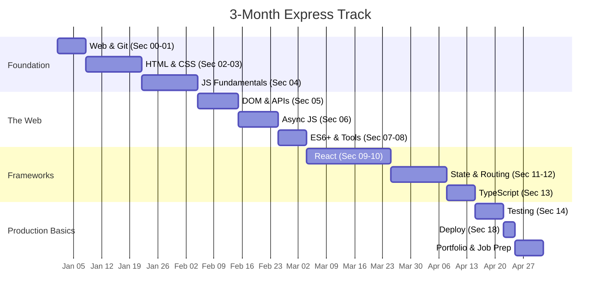
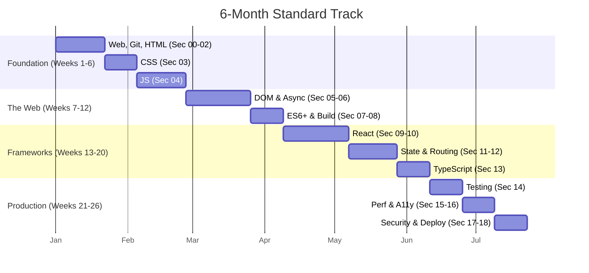
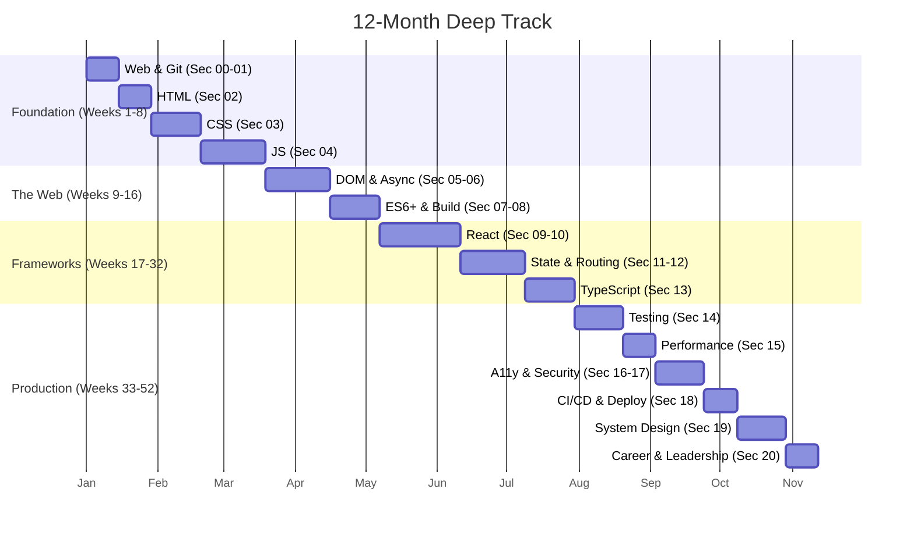
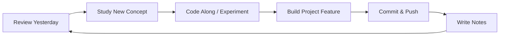

# 📘 Learning Guide

> **How to use this roadmap effectively — plans, tips, resources, and progress tracking**

---

## How to Use This Roadmap Effectively

```
┌─────────────────────────────────────────────────────────────────┐
│                         HOW TO LEARN                            │
├─────────────────────────────────────────────────────────────────┤
│                                                                  │
│  1. SKIM FIRST → Read the section overview and key topics       │
│  2. STUDY → Go through resources (docs, videos, tutorials)      │
│  3. CODE → Build the project(s) without looking at solutions    │
│  4. REFLECT → What was hard? What did you learn?                │
│  5. REVIEW → Come back in a week and make small improvements    │
│  6. MOVE ON → Only after completing all projects                │
│                                                                  │
│  ⚠ NEVER skip projects. Theory without practice is forgotten.   │
│  ⚠ Don't copy-paste code. Type it out yourself.                 │
│  ⚠ Get stuck for 30 min before asking for help.                 │
│                                                                  │
└─────────────────────────────────────────────────────────────────┘
```

---

## Learning Principles

### 1. Project-Based Learning

```
Theory → Practice → Retention
  20%       60%       80%

Read a concept → Build something with it → You remember it.
```

- Each section ends with a project
- Projects compound: each one uses skills from previous sections
- You build a portfolio of 20+ real projects

### 2. Spaced Repetition

Use a system to revisit concepts at increasing intervals:

| Interval | Activity |
|----------|----------|
| 1 day | Review what you learned yesterday |
| 3 days | Re-read notes from last week |
| 1 week | Refactor a project from 2 sections ago |
| 1 month | Build something combining old and new skills |
| 3 months | Rebuild a project from scratch — faster this time |

**Tools:** Anki (flashcards), Notion, or a simple markdown journal.

### 3. Build in Public

- Share your projects on Twitter/LinkedIn
- Write blog posts about what you built
- Post your code on GitHub with good READMEs
- Give feedback to others learning the same topics

**Why it works:**
- Accountability keeps you going
- Feedback improves your work
- Network effects lead to opportunities
- You build a portfolio that hiring managers can see

### 4. Teach to Learn

The best way to learn something is to teach it:

```
┌──────────────────────┐
│ Learn a concept      │
└──────────┬───────────┘
           ▼
┌──────────────────────┐
│ Explain it aloud     │
│ (rubber duck debug)  │
└──────────┬───────────┘
           ▼
┌──────────────────────┐
│ Write a blog post    │
│ or make a video      │
└──────────┬───────────┘
           ▼
┌──────────────────────┐
│ Mentor someone else  │
└──────────────────────┘
```

---

## Study Plan Tracks

Choose the track that fits your schedule:

| Track | Daily Time | Weekly Time | Total Duration | Target Level |
|-------|-----------|-------------|----------------|--------------|
| ⚡ Express | 3-4 hrs | 20-25 hrs | 3 months | Junior |
| 🏃 Standard | 2-3 hrs | 12-15 hrs | 6 months | Mid-level |
| 🧘 Deep | 1-2 hrs | 8-10 hrs | 12 months | Senior |

---

### 3-Month Express Track (20+ hrs/week)

**Target:** Junior frontend engineer ready for first job
**Focus:** Practical skills, portfolio, interview prep



**Weekly Schedule (3-Month):**

| Day | Morning (1 hr) | Evening (2-3 hrs) |
|-----|---------------|-------------------|
| Mon | Review + flashcards | Study new section |
| Tue | Read docs | Code along with tutorial |
| Wed | Review | Build project |
| Thu | Read docs | Build project (continued) |
| Fri | Review week's work | Polish project + push to GitHub |
| Sat | Deep work session | Full day project building |
| Sun | Rest / light review | Plan next week |

---

### 6-Month Standard Track (12-15 hrs/week)

**Target:** Mid-level frontend engineer
**Focus:** Strong fundamentals, framework mastery, some production skills



**Weekly Schedule (6-Month):**

| Day | Time | Activity |
|-----|------|----------|
| Mon | 1.5 hrs | Study new concepts + take notes |
| Tue | 1.5 hrs | Code along with tutorials |
| Wed | 2 hrs | Project work |
| Thu | 2 hrs | Project work (continued) |
| Fri | 1.5 hrs | Polish, refactor, write blog post |
| Sat | 3-4 hrs | Deep work: full project or review |
| Sun | Off | Rest |

---

### 12-Month Deep Track (8-10 hrs/week)

**Target:** Senior frontend engineer
**Focus:** Deep understanding, architecture, leadership, production excellence



**Weekly Schedule (12-Month):**

| Day | Time | Activity |
|-----|------|----------|
| Mon | 1 hr | Reading + note-taking |
| Tue | 1 hr | Video tutorials |
| Wed | 1.5 hrs | Project work |
| Thu | 1 hr | Project work |
| Fri | 1 hr | Review + flashcards |
| Sat | 2-3 hrs | Deep work / blog writing |
| Sun | Off | Rest |

---

## Resource Recommendations

### Books

| Title | Author | Covers Sections |
|-------|--------|-----------------|
| **Eloquent JavaScript** | Marijn Haverbeke | 04, 05, 06, 07 |
| **You Don't Know JS (Series)** | Kyle Simpson | 04, 06, 07 |
| **CSS: The Definitive Guide** | Eric Meyer | 03 |
| **HTML & CSS** | Jon Duckett | 02, 03 |
| **Learning React** | Alex Banks & Eve Porcello | 09, 10 |
| **Effective TypeScript** | Dan Vanderkam | 13 |
| **Testing JavaScript** | Kent C. Dodds | 14 |
| **The Pragmatic Programmer** | Andy Hunt & Dave Thomas | 19, 20 |
| **Staff Engineer** | Will Larson | 20 |
| **Designing Data-Intensive Applications** | Martin Kleppmann | 19 (bonus) |

### Free Online Courses

| Course | Platform | Sections |
|--------|----------|----------|
| **CS50: Intro to Computer Science** | Harvard/edX | 00, 01 |
| **FreeCodeCamp Responsive Web Design** | FreeCodeCamp | 02, 03 |
| **JavaScript: The Hard Parts** | Frontend Masters | 04, 06 |
| **Complete Intro to React** | Frontend Masters (free) | 09 |
| **TypeScript Handbook** | TypeScriptLang.org | 13 |
| **Web Accessibility by Google** | Udacity (free) | 16 |

### Paid Courses (Highly Recommended)

| Course | Author | Cost | Sections |
|--------|--------|------|----------|
| **The Odin Project** | Open Source | Free | 01-08 |
| **Full Stack Open** | University of Helsinki | Free | 09-13 |
| **Epic React** | Kent C. Dodds | Paid | 09-12 |
| **Just JavaScript** | Dan Abramov | Paid | 04, 06 |
| **Testing JavaScript** | Kent C. Dodds | Paid | 14 |
| **TypeScript for Professionals** | Mosh Hamedani | Paid | 13 |

### Documentation to Read (Not Just Skim)

- [MDN Web Docs](https://developer.mozilla.org/en-US/) — always start here
- [React Docs](https://react.dev/) — the new docs are excellent
- [TypeScript Handbook](https://www.typescriptlang.org/docs/)
- [Node.js Docs](https://nodejs.org/en/docs/) — for build tools
- [Web.dev](https://web.dev/) — performance & a11y

### YouTube Channels

| Channel | Best For |
|---------|----------|
| Fireship | Quick overviews, tech news |
| Web Dev Simplified | CSS, JS, React tutorials |
| Kevin Powell | CSS deep dives |
| Jack Herrington | React patterns, testing |
| Theo Browne | React, TypeScript, architecture |
| Josh Comeau | CSS, React, interactive tutorials |
| Fun Fun Function (archived) | JS fundamentals |
| Ben Awad | React, TypeScript, fullstack |

---

## Common Pitfalls to Avoid

```
┌───────────────────────────────────────────────────────┐
│              🚫 COMMON PITFALLS                       │
├───────────────────────────────────────────────────────┤
│                                                       │
│  ❌ 1. Tutorial Hell                                   │
│      → Watching endless tutorials without coding      │
│      ✓ Fix: Code along. Every video = 1 project        │
│                                                       │
│  ❌ 2. Framework First                                │
│      → Learning React before understanding JS         │
│      ✓ Fix: Complete Phase 1 & 2 before Phase 3       │
│                                                       │
│  ❌ 3. Perfectly Polished Portfolio                   │
│      → Spending months making projects perfect        │
│      ✓ Fix: Ship fast, improve later. Done > perfect  │
│                                                       │
│  ❌ 4. Skipping the Hard Parts                        │
│      → Avoiding closures, event loop, this keyword    │
│      ✓ Fix: Hard parts separate seniors from juniors   │
│                                                       │
│  ❌ 5. Copy-Paste Coding                              │
│      → Copying Stack Overflow without understanding   │
│      ✓ Fix: Type every line. Understand each character │
│                                                       │
│  ❌ 6. Not Reading Documentation                      │
│      → Learning from articles only, never docs        │
│      ✓ Fix: Start with MDN, end with MDN               │
│                                                       │
│  ❌ 7. Comparison to Others                           │
│      → "They learned React in 2 weeks, why can't I?"  │
│      ✓ Fix: Your journey is yours. Go at your pace.    │
│                                                       │
│  ❌ 8. Not Building in Public                         │
│      → Learning silently, no portfolio, no feedback   │
│      ✓ Fix: Share code, write blogs, ask for feedback  │
│                                                       │
│  ❌ 9. Ignoring Accessibility                         │
│      → Building apps that exclude millions of users   │
│      ✓ Fix: Learn a11y from day one. It's not optional.│
│                                                       │
│  ❌ 10. No Rest Days                                  │
│       → Burning out after 2 weeks of intense study    │
│       ✓ Fix: Take breaks. Sleep. Exercise.  Rest is   │
│         productive.                                   │
│                                                       │
└───────────────────────────────────────────────────────┘
```

### The Dunning-Kruger Effect in Frontend Learning

```
                     Confidence
                        ▲
                        │   🏔 Peak of "I know everything"
                        │    (after first React app)
                        │       ↘
                        │         ↓ Valley of "I know nothing"
                        │           (when you see real codebases)
                        │              ↘
                        │                → Slope of Enlightenment
                        │                  (steady, humble growth)
                        └──────────────────────────────► Time
```

Expect this pattern. It's normal. The valley means you're growing.

---

## Progress Tracking Template

Use this template to track your progress. Copy it into a markdown file or Notion.

---

### Phase 1: Foundation

| # | Section | Start | End | Status | Project | Notes |
|---|---------|-------|-----|--------|---------|-------|
| 00 | How the Web Works | | | ☐ | — | |
| 01 | Terminal, Git & GitHub | | | ☐ | ☐ Repo Setup | |
| 02 | HTML & Semantic Web | | | ☐ | ☐ Landing Page | |
| 03 | CSS & Visual Design | | | ☐ | ☐ Portfolio | |
| 04 | JS Fundamentals | | | ☐ | ☐ Calculator | |

### Phase 2: The Web

| # | Section | Start | End | Status | Project | Notes |
|---|---------|-------|-----|--------|---------|-------|
| 05 | DOM & Browser APIs | | | ☐ | ☐ Quiz App | |
| 06 | Async JS & HTTP | | | ☐ | ☐ Weather App | |
| 07 | Modern ES6+ & Tooling | | | ☐ | ☐ E-Commerce Page | |
| 08 | Build Tools & Modules | | | ☐ | ☐ Vite Setup | |

### Phase 3: Frameworks

| # | Section | Start | End | Status | Project | Notes |
|---|---------|-------|-----|--------|---------|-------|
| 09 | React Fundamentals | | | ☐ | ☐ Task App | |
| 10 | React Advanced | | | ☐ | ☐ Component Lib | |
| 11 | State Management | | | ☐ | ☐ Cart App | |
| 12 | Routing & Data Fetching | | | ☐ | ☐ Blog App | |
| 13 | TypeScript | | | ☐ | ☐ E-Commerce TS | |

### Phase 4: Production & Architecture

| # | Section | Start | End | Status | Project | Notes |
|---|---------|-------|-----|--------|---------|-------|
| 14 | Testing | | | ☐ | ☐ Test Suite | |
| 15 | Performance | | | ☐ | ☐ Perf Audit | |
| 16 | Accessibility | | | ☐ | ☐ A11y Audit | |
| 17 | Security | | | ☐ | ☐ Security Audit | |
| 18 | CI/CD & Deployment | | | ☐ | ☐ CI/CD Pipeline | |
| 19 | System Design | | | ☐ | ☐ Design Doc | |
| 20 | Career & Leadership | | | ☐ | ☐ Career Plan | |

---

### Weekly Reflection Template

```markdown
# Week of [Date]

## What I Learned This Week
- 
- 

## What I Built
- [Project name]: [link to GitHub]
- 

## What Was Hard
- 
- 

## What I'll Do Next Week
- [ ] 
- [ ] 

## Questions I Have
- 
- 

## Resources I Used
- 
- 
```

---

## Daily Study Flow



---

## Motivation System

```
Weeks 1-4:   ⚡ High energy, everything is new
Weeks 5-8:   😐 Plateau, things get harder
Weeks 9-12:  🥵 Potential burnout zone
Weeks 13+:   🚀 Things click, momentum builds

Strategy for tough weeks:
- Reduce scope, not consistency (30 min > 0 min)
- Revisit a fun project from earlier
- Join a community (Discord, Twitter, local meetup)
- Remember why you started
```

---

## Community & Accountability

| Platform | Purpose |
|----------|---------|
| [Frontend Mentor](https://www.frontendmentor.io/) | Practice challenges + community |
| [r/Frontend](https://reddit.com/r/Frontend) | Discussion and questions |
| [r/learnprogramming](https://reddit.com/r/learnprogramming) | Beginner questions |
| [Dev.to](https://dev.to/) | Blogging and community |
| [Frontend Masters Discord](https://discord.gg/frontendmasters) | Community |
| [Reactiflux Discord](https://www.reactiflux.com/) | React-specific community |

---

## The Most Important Rule

> **Consistency beats intensity.**

Studying 1 hour every day for a year (365 hours) is far more effective than studying 8 hours a day for 45 days (360 hours) and then burning out.

Show up every day. Even for 30 minutes. Especially on days you don't feel like it.

---

> Next: [PROJECT_INDEX.md](./PROJECT_INDEX.md) — Complete index of all projects
