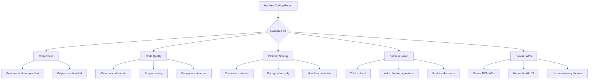
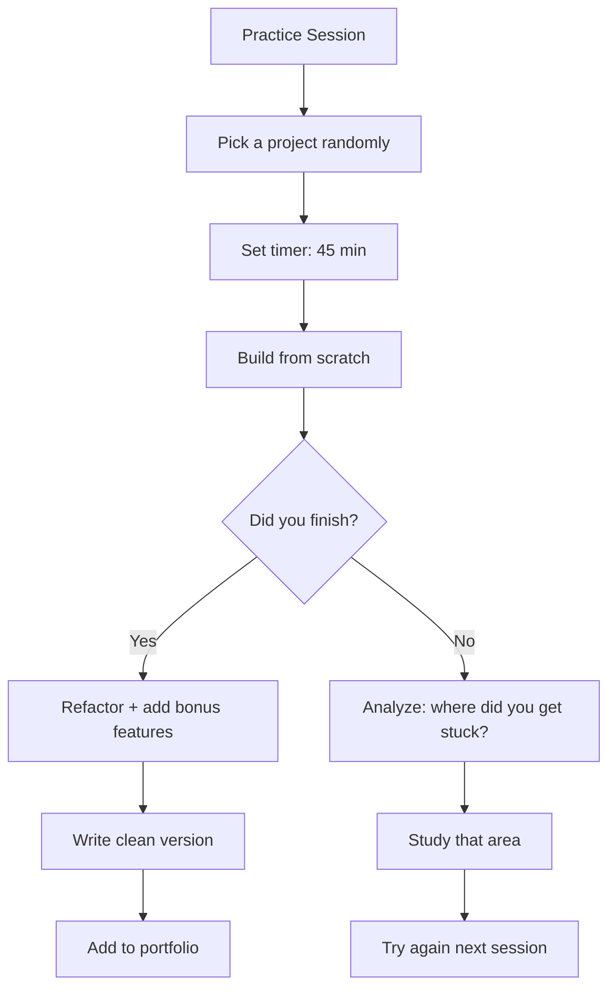
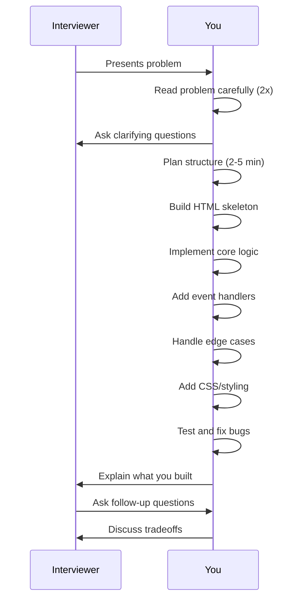

# 🖥️ Machine Coding Interview Guide

> **Everything you need to ace frontend machine coding rounds — 12 projects, common patterns, time management, and evaluation criteria**

---

## What is Machine Coding?

Machine coding (also called "frontend coding round" or "pair programming round") is a type of interview where you build a **small but complete** frontend application within a **fixed time limit** (usually 30-60 minutes).

```
┌─────────────────────────────────────────────────────────────┐
│                  MACHINE CODING INTERVIEW                   │
├─────────────────────────────────────────────────────────────┤
│                                                             │
│  • You are given a problem statement                        │
│  • You must build a working UI from scratch                 │
│  • You have limited time (30/45/60 min)                     │
│  • You can use the browser, editor, and sometimes web       │
│  • Interviewer may:                                         │
│      ├── Watch silently (most common)                       │
│      ├── Ask you to think aloud                             │
│      └── Add features/changes on the fly                    │
│                                                             │
│  💡 Goal: Demonstrate coding ability, not perfection        │
│                                                             │
└─────────────────────────────────────────────────────────────┘
```

### What Interviewers Look For



---

## The 12 Machine Coding Projects

```
┌─────────────────────────────────────────────────────────────────┐
│                   12 MACHINE CODING PROJECTS                    │
├─────────────────────────────────────────────────────────────────┤
│                                                                  │
│  1. ⭐ Star Rating Widget       7. 🎯 Typeahead / Autocomplete  │
│  2. 📅 Calendar Picker          8. 📰 Infinite Scroll List      │
│  3. 🍔 File Explorer / Tree     9. ✅ Multi-Step Form           │
│  4. 🎨 Image Carousel          10. 🛒 Shopping Cart (mini)      │
│  5. 📋 Nested Comments         11. 🎵 Music Player              │
│  6. 🔢 Tic-Tac-Toe Game        12. 📊 Interactive Table         │
│                                                                  │
│  Each project is described below with approaches, patterns,     │
│  and tips specific to that project type.                        │
│                                                                  │
└─────────────────────────────────────────────────────────────────┘
```

---

### 1. ⭐ Star Rating Widget

**Description:** Build an interactive star rating component where users can hover to preview and click to select a rating. Show 5 stars by default, support half-stars (optional).

**Approach:**
```
┌──────────────────────────────────────┐
│  Data: selectedRating (state)        │
│        hoveredRating (state)          │
│                                       │
│  Render: 5 star elements              │
│          ⋮                            │
│  Events: mouseenter → set hovered     │
│          mouseleave → set hovered = 0 │
│          click     → set selected     │
│                                       │
│  Bonus: keyboard support (arrow keys) │
│         half-star precision           │
│         accessible aria attributes    │
└──────────────────────────────────────┘
```

**Key Patterns:** State management, event handlers, CSS transitions, accessible markup
**Common Libraries Allowed:** None (pure Vanilla JS / React)
**Time:** 20-30 min

**Tips:**
- Use CSS for the filled/unfilled star visuals (pseudo-elements or SVG)
- Make each star a button with `aria-label` for accessibility
- Handle edge case: rating reset (clicking same star again)

---

### 2. 📅 Calendar Picker / Date Picker

**Description:** Build a calendar widget that shows a monthly view with navigation (prev/next month), allows selecting a date, and displays the selected date.

**Approach:**
```
┌──────────────────────────────────────────────────┐
│  Data: currentMonth, currentYear, selectedDate   │
│                                                   │
│  Render:                                          │
│    ┌─────────────────────────┐                    │
│    │  < Jan       2025   >   │                    │
│    ├──┬──┬──┬──┬──┬──┬──┤   │                    │
│    │Mo│Tu│We│Th│Fr│Sa│Su│   │                    │
│    ├──┼──┼──┼──┼──┼──┼──┤   │                    │
│    │  │  │  │1 │2 │3 │4 │   │                    │
│    │5 │6 │7 │8 │9 │10│11│   │                    │
│    │12│13│14│15│16│17│18│   │                    │
│    │19│20│21│22│23│24│25│   │                    │
│    │26│27│28│29│30│31│  │   │                    │
│    └──┴──┴──┴──┴──┴──┴──┘   │                    │
│                                                   │
│  Logic: getDaysInMonth(), getFirstDayOfMonth()    │
│         prevMonth(), nextMonth()                  │
│                                                   │
└──────────────────────────────────────────────────┘
```

**Key Patterns:** Date manipulation, grid rendering, state management
**Time:** 35-50 min

**Tips:**
- Know `Date` API: `new Date()`, `getMonth()`, `getFullYear()`, `getDate()`, `getDay()`
- Calculate days in month: `new Date(year, month + 1, 0).getDate()`
- Fill empty cells before the first day
- Highlight today's date
- Bonus: range selection, min/max date constraints

---

### 3. 🍔 File Explorer / Tree View

**Description:** Build a collapsible file/folder tree structure similar to VS Code or Finder. Folders expand/collapse on click. Files are leaf nodes.

**Approach:**
```
┌────────────────────────────────────────────┐
│  Data: Tree structure (nested objects)     │
│                                            │
│  {                                          │
│    name: "root",                           │
│    type: "folder",                         │
│    children: [                             │
│      { name: "src", type: "folder", ... }, │
│      { name: "index.html", type: "file" }  │
│    ]                                        │
│  }                                          │
│                                            │
│  Render: Recursive component               │
│          Each folder: toggle expansion      │
│          Each file: render with icon        │
│                                            │
│  Events: click → toggle expanded state     │
│          dblclick → select file             │
│                                            │
└────────────────────────────────────────────┘
```

**Key Patterns:** Recursive rendering, tree data structures, toggle state
**Time:** 30-45 min

**Tips:**
- Use recursive components (React) or recursive rendering functions (Vanilla)
- Track `expandedIds` as a Set for O(1) lookups
- Pass depth/indent as a prop
- Use CSS for indentation (padding-left based on depth)
- Bonus: add/delete nodes, rename, drag-to-reorder

---

### 4. 🎨 Image Carousel / Slider

**Description:** Build an image carousel that auto-plays, has prev/next buttons, dot indicators, and supports swipe on mobile.

**Approach:**
```
┌──────────────────────────────────────────────┐
│  ┌──────────────────────────────────┐         │
│  │  ◀  [Image]                    ▶  │         │
│  └──────────────────────────────────┘         │
│        ● ● ○ ● ●  (dot indicators)           │
│                                               │
│  Data: currentIndex, images[], isAutoPlaying  │
│                                               │
│  Render: translateX transform based on index  │
│                                               │
│  Events:                                      │
│    prev/next → update currentIndex            │
│    dot click → jump to index                  │
│    touchstart/touchmove → swipe detection     │
│    mouseenter → pause auto-play               │
│    mouseleave → resume auto-play              │
│                                               │
└──────────────────────────────────────────────┘
```

**Key Patterns:** CSS transforms, transitions, interval management, touch events
**Time:** 30-45 min

**Tips:**
- Use `transform: translateX()` for smooth transitions (GPU-accelerated)
- Wrap `setInterval` in a `useEffect` with cleanup
- Infinite loop: when reaching end, jump to start (with or without animation)
- Accessibility: `aria-roledescription="carousel"`, `aria-label` on buttons
- Bonus: fade transition, thumbnail navigation, keyboard shortcuts

---

### 5. 📋 Nested Comments / Reddit-Style Thread

**Description:** Build a nested comment system where users can reply to comments at any depth, with expand/collapse functionality.

**Approach:**
```
┌──────────────────────────────────────────────┐
│  Data: Comment thread (recursive structure)  │
│                                              │
│  {                                           │
│    id: 1, text: "...",                       │
│    replies: [                                │
│      { id: 2, text: "...", replies: [...] }, │
│      ...                                     │
│    ]                                         │
│  }                                           │
│                                              │
│  Render: Recursive comment component         │
│          Each comment has: text, vote, reply │
│          Reply form appears inline           │
│                                              │
│  Features:                                   │
│    Add new top-level comment                 │
│    Reply to any comment                      │
│    Collapse/expand threads                   │
│    Vote up/down                              │
│    Sort by new/top                           │
│                                              │
└──────────────────────────────────────────────┘
```

**Key Patterns:** Recursive data, immutable state updates, inline forms
**Time:** 40-55 min

**Tips:**
- Use recursive component for rendering
- For immutable updates at depth, use spread with computed keys, or Immer
- Track collapsed comment IDs in a Set
- Comment text area should auto-resize
- Handle empty comments (validation)
- Bonus: edit, delete, timestamp display

---

### 6. 🔢 Tic-Tac-Toe

**Description:** Build a 3x3 Tic-Tac-Toe game with two-player mode, win detection, draw detection, and move history.

**Approach:**
```
┌──────────────────────────────────────────────┐
│  Data: board (3x3 array), currentPlayer,     │
│        winner, moveHistory[]                 │
│                                              │
│  Render:                                     │
│    ┌───┬───┬───┐                            │
│    │ X │ O │ X │                            │
│    ├───┼───┼───┤                            │
│    │ O │ X │ O │                            │
│    ├───┼───┼───┤                            │
│    │ X │   │   │                            │
│    └───┴───┴───┘                            │
│                                              │
│  Logic:                                      │
│    checkWinner(): check rows, cols, diags    │
│    isDraw(): check if all cells filled       │
│    undo(): pop from moveHistory              │
│    reset(): clear board                      │
│                                              │
└──────────────────────────────────────────────┘
```

**Key Patterns:** 2D arrays, game logic, turn management, win detection
**Time:** 30-45 min

**Tips:**
- Store board as 1D array of length 9 for simpler indexing
- Win conditions: precompute all 8 winning combinations
- Highlight winning line when game ends
- Add game status display: "X's turn", "O wins!", "Draw!"
- Bonus: AI opponent (minimax), score tracking, animation

---

### 7. 🎯 Typeahead / Autocomplete / Search Suggestions

**Description:** Build a search input that shows suggestions as the user types, with debouncing, keyboard navigation, and highlighted matches.

**Approach:**
```
┌──────────────────────────────────────────────┐
│  ┌─────────────────────────────┐             │
│  │ 🔍 react             ✕ │             │
│  └─────────────────────────────┘             │
│  ┌─────────────────────────────┐             │
│  │ react                       │             │
│  │ react-native                │             │
│  │ react-router                │ ← selected │
│  │ react-query                 │             │
│  │ react-icons                 │             │
│  └─────────────────────────────┘             │
│                                               │
│  Data: inputValue, suggestions[],             │
│        selectedIndex, isOpen                  │
│                                               │
│  Events:                                      │
│    input → debounce → fetch suggestions       │
│    keydown(ArrowUp/Down) → navigate list      │
│    keydown(Enter) → select                    │
│    keydown(Escape) → close                    │
│    click outside → close                      │
│                                               │
└──────────────────────────────────────────────┘
```

**Key Patterns:** Debouncing, keyboard navigation, click-outside detection, highlighting text
**Time:** 35-50 min

**Tips:**
- Implement `debounce` from scratch (or explain it well)
- Use `AbortController` to cancel stale requests
- Highlight matching text using string splitting/regex
- Track `selectedIndex` for keyboard navigation
- Handle: empty input, no results, loading state, error state
- Accessibility: `role="combobox"`, `aria-autocomplete`, `aria-activedescendant`

---

### 8. 📰 Infinite Scroll List

**Description:** Build a list that loads more items as the user scrolls down (infinite scroll). Could be images, tweets, or any feed.

**Approach:**
```
┌──────────────────────────────────────────────┐
│  Data: items[], page, hasMore, loading        │
│                                               │
│  Render:                                      │
│    ┌──────────────────────────────────┐       │
│    │ Item 1                          │       │
│    │ Item 2                          │       │
│    │ Item 3                          │       │
│    │ ...                             │       │
│    │ [Loading spinner]               │       │
│    └──────────────────────────────────┘       │
│                                               │
│  Logic:                                       │
│    IntersectionObserver on sentinel element   │
│    → when visible → fetch next page           │
│    → append to items array                    │
│                                               │
│  Alternatives:                                │
│    scroll event + debounce +                 │
│    scrollHeight - scrollTop check             │
│                                               │
└──────────────────────────────────────────────┘
```

**Key Patterns:** Intersection Observer, pagination, scroll management, loading states
**Time:** 30-45 min

**Tips:**
- Use `IntersectionObserver` over scroll event (better performance)
- Put a sentinel `<div>` at the bottom of the list
- Handle: initial load, loading more, error state, no more items ("You've reached the end")
- Virtual scroll for large lists (bonus)
- Remember to `unobserve` when there are no more pages

---

### 9. ✅ Multi-Step Form (Wizard)

**Description:** Build a multi-step form (e.g., checkout wizard) with step navigation, validation per step, progress indicator, and summary.

**Approach:**
```
┌──────────────────────────────────────────────┐
│  Step 1 ──→ Step 2 ──→ Step 3 ──→ Review    │
│  ● ───── ○ ───── ○ ───── ○                  │
│                                              │
│  ┌──────────────────────────────────────┐    │
│  │  Step 2: Shipping Address            │    │
│  │                                      │    │
│  │  Name:    [________________]         │    │
│  │  Address: [________________]         │    │
│  │  City:    [________________]         │    │
│  │  ZIP:     [________________]         │    │
│  │                                      │    │
│  │  [← Back]           [Next →]         │    │
│  └──────────────────────────────────────┘    │
│                                              │
│  Data: stepIndex, formData{}, errors{}       │
│                                              │
│  Logic: validateStep() before next           │
│         canGoNext: step validated            │
│         isLastStep: show Submit              │
│                                              │
└──────────────────────────────────────────────┘
```

**Key Patterns:** Form validation, multi-step state, progress tracking, conditional rendering
**Time:** 40-55 min

**Tips:**
- Store all form data in a single object, update piece by piece
- Validate only current step before allowing "Next"
- Show errors inline (per field)
- Allow "Back" without validation
- Preserve data when navigating back
- Progress bar updates based on current step
- On last step, show summary before submit

---

### 10. 🛒 Shopping Cart (Mini)

**Description:** Build a mini shopping cart with product listing, add/remove items, quantity update, and price calculations.

**Approach:**
```
┌──────────────────────────────────────────────┐
│  Products:                    Cart:          │
│  ┌────────────────┐          ┌────────────┐ │
│  │ Product A $10  │          │ Item A x2  │ │
│  │ [Add to Cart]   │          │ Item B x1  │ │
│  ├────────────────┤          │            │ │
│  │ Product B $15  │          │ Total: $35 │ │
│  │ [Add to Cart]   │          │            │ │
│  └────────────────┘          │ [Checkout]  │ │
│                               └────────────┘ │
│                                               │
│  Data: products[], cart{ [id]: quantity }     │
│                                               │
│  Derived: totalItems, totalPrice              │
│           cartItems with product details      │
│                                               │
│  Features:                                    │
│    Add to cart, remove from cart              │
│    Increment/decrement quantity               │
│    Calculate subtotal, total                  │
│    Coupon code (bonus)                        │
│                                               │
└──────────────────────────────────────────────┘
```

**Key Patterns:** State normalization, derived data, immutable updates, calculations
**Time:** 35-50 min

**Tips:**
- Store cart as `{ productId: quantity }` — normalized
- Derive totals (don't store them), recalculate on render
- Handle: empty cart state, remove last item → hide cart
- Quantity controls: min 0 (remove), max stock
- Show cart badge with item count
- Bonus: localStorage persistence

---

### 11. 🎵 Music Player

**Description:** Build a simple music player with play/pause, progress bar, volume control, skip/prev, and playlist.

**Approach:**
```
┌──────────────────────────────────────────────┐
│  ┌──────────────────────────────────────┐     │
│  │          [Album Artwork]             │     │
│  │          Song Title                  │     │
│  │          Artist Name                 │     │
│  │                                      │     │
│  │  ─────────●───────────────────────   │     │
│  │  1:23                   3:45         │     │
│  │                                      │     │
│  │  ◀◀  ⏸  ▶▶   🔊━━━━━━━░━           │     │
│  └──────────────────────────────────────┘     │
│                                               │
│  ┌──────────────────────────────────────┐     │
│  │  Playlist:                          │     │
│  │  ▶ Song 1 (current)                 │     │
│  │    Song 2                           │     │
│  │    Song 3                           │     │
│  └──────────────────────────────────────┘     │
│                                               │
│  Data: currentIndex, isPlaying, currentTime,  │
│        duration, volume, playlist[]           │
│                                               │
│  Logic: audio element controls                │
│         formatTime(), updateProgress()        │
│         nextTrack(), prevTrack()              │
│                                               │
└──────────────────────────────────────────────┘
```

**Key Patterns:** `<audio>` API, time formatting, progress tracking, playlist management
**Time:** 40-55 min

**Tips:**
- Use the HTML `<audio>` element's API: `play()`, `pause()`, `currentTime`, `duration`
- Listen to `timeupdate` event for progress bar
- Format time as `m:ss`
- Make progress bar draggable (bonus)
- Handle: end of track → next track, loop mode, shuffle mode
- Keyboard shortcuts: space (play/pause), arrows (seek)

---

### 12. 📊 Interactive Table / Data Grid

**Description:** Build an interactive data table with sortable columns, search/filter, pagination, and row selection.

**Approach:**
```
┌──────────────────────────────────────────────┐
│  [🔍 Search...]                              │
│                                               │
│  Name ▲ │ Age │ City │ Action                │
│  ───────┼─────┼──────┼───────                │
│  Alice  │ 28  │ NYC  │ [Edit]                │
│  Bob    │ 32  │ SF   │ [Edit]                │
│  Carol  │ 25  │ LA   │ [Edit]                │
│  ...    │ ... │ ...  │ ...                   │
│                                               │
│  Showing 1-10 of 100    [1] [2] [3] [...]    │
│                                               │
│  Data: rows[], sortKey, sortDir, filterText,  │
│        currentPage, pageSize                  │
│                                               │
│  Logic:                                       │
│    filter → sort → paginate → render          │
│    handleSort(columnKey)                      │
│    handleSearch(text)                         │
│    handlePageChange(page)                     │
│                                               │
└──────────────────────────────────────────────┘
```

**Key Patterns:** Data transformation pipeline, sorting algorithms, pagination math
**Time:** 40-55 min

**Tips:**
- Derive all displayed data: `filtered → sorted → paginated`
- Sorting: stable sort, toggle asc/desc, show sort indicator
- Search: case-insensitive, search across multiple columns
- Pagination: calculate total pages, show page numbers with ellipsis
- Make columns configurable
- Bonus: row selection (checkbox), inline editing, column resize

---

## Common Approaches and Patterns

### Pattern 1: State Management

```javascript
// Always start with defining your state shape
const state = {
  items: [],
  selectedId: null,
  isLoading: false,
  error: null
};

// Derive values (don't store what you can compute)
const total = state.items.reduce((sum, item) => sum + item.price, 0);
const isEmpty = state.items.length === 0;
```

### Pattern 2: Event Delegation

```javascript
// Instead of adding listeners to every item, add one to the parent
container.addEventListener("click", (e) => {
  const item = e.target.closest("[data-item-id]");
  if (!item) return;
  const id = item.dataset.itemId;
  handleItemClick(id);
});
```

### Pattern 3: Debouncing

```javascript
function debounce(fn, delay) {
  let timer;
  return (...args) => {
    clearTimeout(timer);
    timer = setTimeout(() => fn(...args), delay);
  };
}
```

### Pattern 4: Keyboard Navigation

```javascript
function handleKeyDown(e, items, selectedIndex) {
  switch(e.key) {
    case "ArrowDown":
      e.preventDefault();
      setSelectedIndex(Math.min(selectedIndex + 1, items.length - 1));
      break;
    case "ArrowUp":
      e.preventDefault();
      setSelectedIndex(Math.max(selectedIndex - 1, 0));
      break;
    case "Enter":
      e.preventDefault();
      selectItem(items[selectedIndex]);
      break;
    case "Escape":
      e.preventDefault();
      closeDropdown();
      break;
  }
}
```

### Pattern 5: Click Outside

```javascript
function useClickOutside(ref, handler) {
  useEffect(() => {
    function handleClick(e) {
      if (ref.current && !ref.current.contains(e.target)) {
        handler();
      }
    }
    document.addEventListener("mousedown", handleClick);
    return () => document.removeEventListener("mousedown", handleClick);
  }, [ref, handler]);
}
```

### Pattern 6: Data Transformation Pipeline

```javascript
function processData(rows, { sortKey, sortDir, filterText, page, pageSize }) {
  return rows
    .filter(row => matchesFilter(row, filterText))
    .sort((a, b) => compare(a, b, sortKey, sortDir))
    .slice((page - 1) * pageSize, page * pageSize);
}
```

---

## Time Management Strategies

### 30-Minute Strategy (Fast-Paced)

```
┌──────────────────────────────────────────────┐
│             30-MINUTE STRATEGY               │
├──────────────────────────────────────────────┤
│                                              │
│  ⏱ 0-2 min   Read problem, ask questions    │
│  ⏱ 2-5 min   Plan structure on paper        │
│  ⏱ 5-8 min   Set up HTML + CSS skeleton     │
│  ⏱ 8-20 min  Core JavaScript logic          │
│  ⏱ 20-25 min Add interactivity, event       │
│                  handlers                    │
│  ⏱ 25-28 min Test, fix bugs                 │
│  ⏱ 28-30 min Polish, handle edge cases      │
│                                              │
│  🎯 Scope: Minimal viable product            │
│  ✅ Must have: Works correctly for happy     │
│    path. Basic styling. No crashes.          │
│                                              │
└──────────────────────────────────────────────┘
```

### 45-Minute Strategy (Standard)

```
┌──────────────────────────────────────────────┐
│             45-MINUTE STRATEGY               │
├──────────────────────────────────────────────┤
│                                              │
│  ⏱ 0-3 min   Read problem, ask clarifying    │
│                  questions                   │
│  ⏱ 3-7 min   Plan: components, data flow,   │
│                  edge cases                  │
│  ⏱ 7-12 min  HTML structure + base CSS      │
│  ⏱ 12-30 min Core logic + state management  │
│  ⏱ 30-38 min Add all features + interactivity│
│  ⏱ 38-42 min Test edge cases, fix bugs      │
│  ⏱ 42-45 min Polish: styling, accessibility │
│                                              │
│  🎯 Scope: All required features             │
│  ✅ Must have: All features working, most    │
│    edge cases handled, decent styling.       │
│                                              │
└──────────────────────────────────────────────┘
```

### 60-Minute Strategy (Senior Level)

```
┌──────────────────────────────────────────────┐
│             60-MINUTE STRATEGY               │
├──────────────────────────────────────────────┤
│                                              │
│  ⏱ 0-5 min   Read problem, ask questions,   │
│                  clarify requirements        │
│  ⏱ 5-10 min  Plan architecture: components, │
│                  state, data flow, edge cases│
│  ⏱ 10-15 min HTML structure + CSS setup     │
│  ⏱ 15-35 min Core logic + state management  │
│  ⏱ 35-45 min All required features + extras │
│  ⏱ 45-52 min Accessibility, keyboard nav    │
│  ⏱ 52-57 min Test edge cases, performance   │
│  ⏱ 57-60 min Final polish, refactor naming  │
│                                              │
│  🎯 Scope: Production-quality component      │
│  ✅ Must have: All features, edge cases,     │
│    accessibility, clean code, good naming.   │
│    Bonus features if time permits.           │
│                                              │
└──────────────────────────────────────────────┘
```

### Golden Rules for All Timeframes

```
┌─────────────────────────────────────────────────────┐
│                 GOLDEN RULES                        │
├─────────────────────────────────────────────────────┤
│                                                     │
│  1. Get something working FIRST, then improve       │
│     └── Don't over-engineer early                   │
│                                                     │
│  2. Hardcode data if API is unavailable              │
│     └── Focus on UI logic, not network              │
│                                                     │
│  3. Use simple state before abstractions             │
│     └── useState > useReducer > Context > Redux     │
│                                                     │
│  4. CSS last, functionality first                    │
│     └── Ugly but working > beautiful but broken     │
│                                                     │
│  5. Keep talking — explain your thought process      │
│     └── Interviewers can't read your mind            │
│                                                     │
│  6. Don't panic if stuck — try something simple      │
│     └── Even a partial solution shows competence    │
│                                                     │
│  7. Handle empty/loading/error states                │
│     └── Shows maturity and experience               │
│                                                     │
└─────────────────────────────────────────────────────┘
```

---

## Evaluation Criteria

### Rubric (How You'll Be Scored)

| Category | Weight | Excellent (5) | Good (3-4) | Poor (1-2) |
|----------|--------|---------------|------------|------------|
| **Functionality** | 30% | All features work, edge cases handled | Main features work, minor bugs | Core features broken or missing |
| **Code Quality** | 25% | Clean, readable, well-named, modular | Readable with minor issues | Messy, hard to follow, no structure |
| **Problem Solving** | 20% | Identifies patterns, considers tradeoffs | Works through problem methodically | Jumps in without planning, gets stuck |
| **Communication** | 15% | Thinks aloud, explains decisions, asks questions | Explains sometimes, mostly quiet | No explanation, doesn't ask clarifying questions |
| **Browser API Use** | 10% | Uses appropriate APIs effectively | Basic API usage | Unnecessary frameworks, wrong approaches |

### Red Flags (Automatic Reject)

```
❌  Uses jQuery in 2025
❌  Copies code without understanding
❌  Can't explain their own code
❌  Ignores interviewer's hints
❌  No error handling at all
❌  Data leaks, XSS vulnerabilities
❌  Doesn't finish anything
```

### Green Flags (Automatic Hire Signal)

```
✅  Asks clarifying questions before coding
✅  Handles loading, empty, error states
✅  Makes the component keyboard accessible
✅  Notices and fixes edge cases unprompted
✅  Writes clean, self-documenting code
✅  Uses semantic HTML + proper ARIA
✅  Refactors code to be more reusable
```

---

## Practice Schedule

### 4-Week Machine Coding Prep Plan

| Week | Focus | Projects | Time |
|------|-------|----------|------|
| **Week 1** | Vanilla JS DOM | Star Rating, Tic-Tac-Toe, Carousel | 3 sessions × 45 min |
| **Week 2** | Data Structures + Events | File Explorer, Nested Comments, Calendar | 3 sessions × 45 min |
| **Week 3** | Async + Performance | Typeahead, Infinite Scroll, Data Table | 3 sessions × 45 min |
| **Week 4** | Full Apps + Mock Interviews | Music Player, Shopping Cart, Multi-Step Form | 3 sessions × 60 min |

### Weekly Practice Structure



### Peer Mock Interview Format

```
┌────────────────────────────────────────────────────┐
│              MOCK INTERVIEW FORMAT                 │
├────────────────────────────────────────────────────┤
│                                                    │
│  Person A (Candidate): Solve the problem           │
│  Person B (Interviewer): Observe, take notes,      │
│    ask questions, suggest edge cases               │
│                                                    │
│  ⏱ 5 min    B explains the problem                 │
│  ⏱ 45 min   A codes (B observes)                  │
│  ⏱ 10 min   Debrief: what went well, what to      │
│                  improve                           │
│                                                    │
│  Roles switch for the next session                 │
│                                                    │
└────────────────────────────────────────────────────┘
```

---

## Tips for Each Project Type

### DOM Manipulation Projects (Star Rating, Carousel, Calendar)

- **Start with HTML structure** that mirrors the final layout
- Use `data-*` attributes for state that lives in the DOM
- Prefer `classList.toggle()` over setting className strings
- Cache DOM queries, especially in event handlers

### Recursive Data Projects (File Explorer, Nested Comments)

- **Draw the tree** before writing code
- Use a recursive rendering function/component
- Pass `depth` as a parameter for indentation
- Store collapsed/expanded state in a `Set` of IDs

### Game/Logic Projects (Tic-Tac-Toe, Shopping Cart)

- **Separate game logic from rendering** completely
- Write pure functions for logic (e.g., `checkWinner(board)`)
- Use immutable state updates
- Test edge cases: draw, empty state, max quantity

### Async/AJAX Projects (Typeahead, Infinite Scroll)

- **Always handle loading, empty, error, and success states**
- Use `AbortController` to cancel stale requests
- Implement debounce from scratch
- Show skeleton/spinner during loading

### Form/Input Projects (Multi-Step Form, Data Table)

- **Derive, don't store** — compute displayed data from source data
- Validate incrementally (per step/per field)
- Use a single state object for all form data
- Allow back navigation without validation

### Media/Audio Projects (Music Player)

- **Use the HTML `<audio>` element** — don't build audio from scratch
- Listen to `timeupdate`, `ended`, `loadedmetadata` events
- Format time display with a utility function
- Handle: end of playlist, shuffle, repeat

---

## Common Mistakes to Avoid

```
┌─────────────────────────────────────────────────────┐
│              COMMON MISTAKES                        │
├─────────────────────────────────────────────────────┤
│                                                     │
│  ❌ Starting to code without planning               │
│     ✓ Take 2-5 min to think and sketch              │
│                                                     │
│  ❌ Using too many libraries/frameworks             │
│     ✓ Use Vanilla JS + browser APIs                 │
│                                                     │
│  ❌ Over-engineering (premature optimization)        │
│     ✓ Simple solution first, then iterate           │
│                                                     │
│  ❌ Not handling edge cases                         │
│     ✓ Ask: what if data is empty? what if error?    │
│                                                     │
│  ❌ Writing CSS before functionality                │
│     ✓ Ugly but working > beautiful but broken       │
│                                                     │
│  ❌ Going silent while coding                       │
│     ✓ Think aloud: "I'm doing X because Y"          │
│                                                     │
│  ❌ Not asking clarifying questions                 │
│     ✓ "Should I handle mobile?" "Is this editable?" │
│                                                     │
│  ❌ Starting over when stuck                        │
│     ✓ Debug what you have first                     │
│                                                     │
└─────────────────────────────────────────────────────┘
```

---

## Environment Setup

Most machine coding interviews provide one of these environments:

```
1. Online Editor (CoderPad, CodeSandbox, Replit)
   → Familiarize yourself with the interface beforehand
   → Usually supports Vanilla JS + React

2. Local Setup (Zoom + VS Code share)
   → Have VS Code ready with extensions
   → Use Live Server for Vanilla JS
   → Have Vite/React template ready

3. Whiteboard / Google Docs (rare)
   → Write pseudocode, not perfect syntax
   → Focus on logic and architecture
```

**What to Have Ready (for local setups):**

```
📁 machine-coding-prep/
   ├── vanilla-template/
   │   ├── index.html  (with CSS + JS linked)
   │   └── style.css
   └── react-template/
       ├── package.json (Vite + React)
       ├── src/
       │   ├── App.jsx
       │   └── index.jsx
       └── index.html
```

---

## Final Checklist Before the Interview

```markdown
## Night Before
- [ ] Review the 12 project types
- [ ] Review common patterns (debounce, keyboard nav, event delegation)
- [ ] Review Date API and array methods
- [ ] Get good sleep (8 hours minimum)
- [ ] Prepare your environment

## Morning Of
- [ ] Eat a good breakfast
- [ ] Test your webcam and microphone
- [ ] Open your editor and template
- [ ] Have water and paper nearby
- [ ] Review this guide one more time

## During the Interview
- [ ] Read the problem TWICE before coding
- [ ] Ask clarifying questions
- [ ] Plan before coding
- [ ] Get something working first
- [ ] Keep talking
- [ ] Handle edge cases
- [ ] Add styling last
- [ ] Don't give up
```

---

## Interview Day Flow



---

## Resources for Further Practice

| Resource | Type | Best For |
|----------|------|----------|
| [GreatFrontend](https://www.greatfrontend.com/) | Practice problems | Machine coding prep |
| [LeetCode Frontend](https://leetcode.com/problemset/javascript/) | Problems | JS-specific challenges |
| [Frontend Mentor](https://www.frontendmentor.io/) | Challenges | Real UI building |
| [Coding Interview University](https://github.com/jwasham/coding-interview-university) | Study guide | General prep |
| [JavaScript Questions](https://github.com/lydiahallie/javascript-questions) | Quiz | JS fundamentals |
| [React Interview Questions](https://github.com/sudheerj/reactjs-interview-questions) | Quiz | React prep |
| [Frontend System Design](https://www.greatfrontend.com/system-design) | Guide | System design |
| [Pramp](https://www.pramp.com/) | Mock interviews | Practice with peers |

---

> **Remember:** Machine coding interviews test your ability to **build working software under constraints**. Speed comes from practice. Practice every project type at least 3 times. By your 3rd attempt, you should finish in under 40 minutes.

> Back to [README.md](./README.md)
