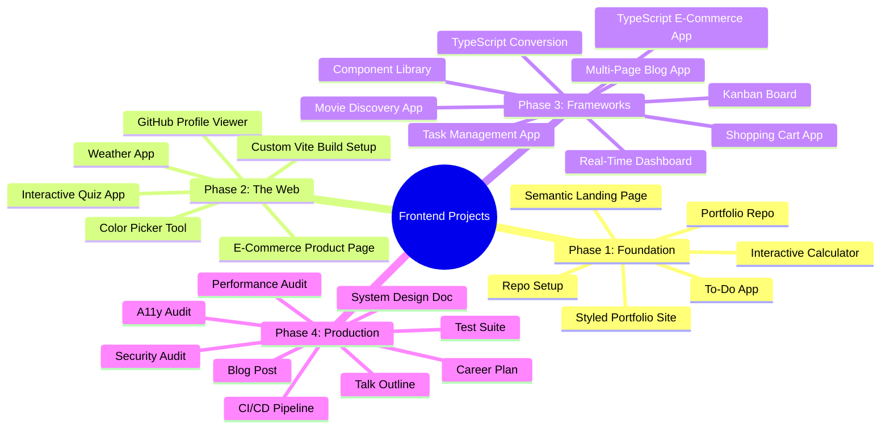
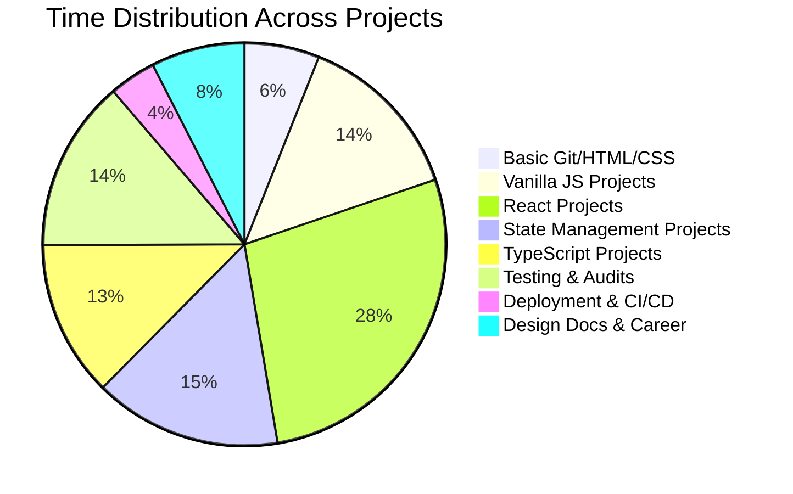

# 📦 Project Index

> **Complete index of all 26+ projects organized by difficulty | Progress checklists | Suggested build order**

---

## Project Overview by Phase



---

## Projects by Difficulty

```
      BEGINNER (10 projects)         INTERMEDIATE (9 projects)        ADVANCED (7 projects)
    ┌──────────────────────┐       ┌──────────────────────┐        ┌──────────────────────┐
    │ 01. Repo Setup       │       │ 11. Quiz App         │        │ 20. Component Library │
    │ 02. Portfolio Repo   │       │ 12. Color Picker     │        │ 21. Kanban Board      │
    │ 03. Semantic Page    │       │ 13. Weather App      │        │ 22. Real-Time Dash.   │
    │ 04. Styled Portfolio │       │ 14. GitHub Viewer    │        │ 23. TS E-Commerce     │
    │ 05. Calculator       │       │ 15. E-Com Page       │        │ 24. System Design Doc │
    │ 06. To-Do App        │       │ 16. Vite Setup       │        │ 25. CI/CD Pipeline    │
    │ 07. Task App         │       │ 17. Task App(React)  │        │ 26. Full Test Suite   │
    │ 08. Movie App        │       │ 18. Shopping Cart    │        │ 27. Perf + A11y Audit │
    │ 09. Multi-Page Blog  │       │ 19. TS Conversion    │        │ 28. Blog + Talk       │
    │ 10. Career Plan      │       │                      │        │                      │
    └──────────────────────┘       └──────────────────────┘        └──────────────────────┘
```

---

## Beginner Projects

These projects require only HTML, CSS, and basic JavaScript. No frameworks, no build tools.

### 1. Repo Setup

| Field | Details |
|-------|---------|
| **Section** | 01 — Terminal, Git & GitHub |
| **Description** | Initialize a local git repository, make commits, create branches, push to GitHub. |
| **Concepts Learned** | git init, add, commit, branch, merge, push, pull, .gitignore |
| **Tech Stack** | Git, GitHub, Markdown, Terminal |
| **⏱ Time** | 2-3 hours |
| **✅ Complete** | ☐ |

### 2. Portfolio Repository

| Field | Details |
|-------|---------|
| **Section** | 01 — Terminal, Git & GitHub |
| **Description** | Create a well-structured GitHub repository for your portfolio with README, multiple branches, and proper git history. |
| **Concepts Learned** | GitHub repo management, README writing, branching strategy, git workflow |
| **Tech Stack** | Git, GitHub, Markdown |
| **⏱ Time** | 2-3 hours |
| **✅ Complete** | ☐ |

### 3. Semantic Landing Page

| Field | Details |
|-------|---------|
| **Section** | 02 — HTML & Semantic Web |
| **Description** | Build a product landing page using only semantic HTML — no CSS, no JS. Focus on structure, accessibility, SEO. |
| **Concepts Learned** | Semantic HTML5, heading hierarchy, forms, accessibility attributes, SEO meta tags |
| **Tech Stack** | HTML5 |
| **⏱ Time** | 4-6 hours |
| **✅ Complete** | ☐ |

### 4. Styled Portfolio Site

| Field | Details |
|-------|---------|
| **Section** | 03 — CSS & Visual Design |
| **Description** | Take your semantic HTML portfolio and add CSS: layouts, typography, responsive design, animations. |
| **Concepts Learned** | Flexbox, Grid, CSS variables, media queries, animations, responsive design |
| **Tech Stack** | HTML5, CSS3 |
| **⏱ Time** | 8-12 hours |
| **✅ Complete** | ☐ |

### 5. Interactive Calculator

| Field | Details |
|-------|---------|
| **Section** | 04 — JavaScript Fundamentals |
| **Description** | Build a fully functional calculator with keyboard support, equation display, and basic math operations. |
| **Concepts Learned** | DOM manipulation, event handling, functions, arithmetic operations, keyboard events |
| **Tech Stack** | HTML, CSS, Vanilla JS |
| **⏱ Time** | 6-10 hours |
| **✅ Complete** | ☐ |

### 6. To-Do App (Vanilla JS)

| Field | Details |
|-------|---------|
| **Section** | 04 — JavaScript Fundamentals |
| **Description** | CRUD to-do list with localStorage persistence — the classic project that teaches everything. |
| **Concepts Learned** | CRUD operations, localStorage, array methods, DOM manipulation, event delegation |
| **Tech Stack** | HTML, CSS, Vanilla JS |
| **⏱ Time** | 8-12 hours |
| **✅ Complete** | ☐ |

### 7. Task Management App (React)

| Field | Details |
|-------|---------|
| **Section** | 09 — React Fundamentals |
| **Description** | Full CRUD task manager with categories, filters, search, and a clean UI built with React. |
| **Concepts Learned** | React components, useState, useEffect, props, controlled forms, lifting state |
| **Tech Stack** | React, CSS Modules, Vite |
| **⏱ Time** | 15-20 hours |
| **✅ Complete** | ☐ |

### 8. Movie Discovery App

| Field | Details |
|-------|---------|
| **Section** | 09 — React Fundamentals |
| **Description** | Browse movies from TMDB API with search, genre filters, pagination, and detail pages. |
| **Concepts Learned** | API integration, custom hooks, loading/error states, routing (basic), pagination |
| **Tech Stack** | React, Fetch/Axios, CSS |
| **⏱ Time** | 15-20 hours |
| **✅ Complete** | ☐ |

### 9. Multi-Page Blog App

| Field | Details |
|-------|---------|
| **Section** | 12 — Routing & Data Fetching |
| **Description** | Blog with homepage, category pages, post details, author page, search, pagination using React Router. |
| **Concepts Learned** | React Router v6, dynamic routes, data fetching, caching, pagination, error boundaries |
| **Tech Stack** | React, React Router, TanStack Query, CSS |
| **⏱ Time** | 20-25 hours |
| **✅ Complete** | ☐ |

### 10. Career Plan Document

| Field | Details |
|-------|---------|
| **Section** | 20 — Soft Skills, Leadership & Career |
| **Description** | Write a comprehensive 1-year, 3-year, and 5-year career plan with milestones. |
| **Concepts Learned** | Career planning, goal setting, self-assessment |
| **Tech Stack** | Markdown, Notion, or Google Docs |
| **⏱ Time** | 3-5 hours |
| **✅ Complete** | ☐ |

---

## Intermediate Projects

These projects require solid JS knowledge and some experience with React or build tools.

### 11. Interactive Quiz App

| Field | Details |
|-------|---------|
| **Section** | 05 — DOM, Browser APIs & Events |
| **Description** | Multiple choice quiz with score tracking, timer, progress bar, and result breakdown. |
| **Concepts Learned** | DOM manipulation, timers, event delegation, localStorage for high scores |
| **Tech Stack** | HTML, CSS, Vanilla JS |
| **⏱ Time** | 10-15 hours |
| **✅ Complete** | ☐ |

### 12. Color Picker Tool

| Field | Details |
|-------|---------|
| **Section** | 05 — DOM, Browser APIs & Events |
| **Description** | Interactive color picker with real-time preview, HEX/RGB/HSL conversion, and color palette saving. |
| **Concepts Learned** | Input events, color models, Canvas API, local storage |
| **Tech Stack** | HTML, CSS, Vanilla JS |
| **⏱ Time** | 8-12 hours |
| **✅ Complete** | ☐ |

### 13. Weather App

| Field | Details |
|-------|---------|
| **Section** | 06 — Async JavaScript & HTTP |
| **Description** | Fetch weather data from OpenWeatherMap API with city search, 5-day forecast, and geolocation. |
| **Concepts Learned** | Fetch API, async/await, API keys, loading/error states, geolocation |
| **Tech Stack** | HTML, CSS, Vanilla JS, OpenWeatherMap API |
| **⏱ Time** | 10-15 hours |
| **✅ Complete** | ☐ |

### 14. GitHub Profile Viewer

| Field | Details |
|-------|---------|
| **Section** | 06 — Async JavaScript & HTTP |
| **Description** | Fetch and display GitHub user profiles, repositories, stats, and contribution activity. |
| **Concepts Learned** | REST APIs, pagination, rate limiting, caching, data visualization |
| **Tech Stack** | HTML, CSS, Vanilla JS, GitHub API |
| **⏱ Time** | 10-15 hours |
| **✅ Complete** | ☐ |

### 15. E-Commerce Product Page

| Field | Details |
|-------|---------|
| **Section** | 07 — Modern ES6+ & Tooling |
| **Description** | Product listing with filtering, sorting, search, cart state management using modern JS patterns. |
| **Concepts Learned** | ES6+ features, module pattern, state management patterns, event delegation, debouncing |
| **Tech Stack** | HTML, CSS, Vanilla JS (ES Modules) |
| **⏱ Time** | 12-18 hours |
| **✅ Complete** | ☐ |

### 16. Custom Vite Build Setup

| Field | Details |
|-------|---------|
| **Section** | 08 — Build Tools & Module System |
| **Description** | Configure Vite from scratch with React, TypeScript, ESLint, Prettier, PostCSS, and environment variables. |
| **Concepts Learned** | Vite config, Babel, PostCSS, ESLint, Prettier, tree shaking, HMR |
| **Tech Stack** | Vite, React, TypeScript, ESLint, PostCSS |
| **⏱ Time** | 4-8 hours |
| **✅ Complete** | ☐ |

### 17. Shopping Cart App

| Field | Details |
|-------|---------|
| **Section** | 11 — State Management |
| **Description** | E-commerce cart with state management (Zustand/Redux Toolkit), product listing, cart management, checkout flow. |
| **Concepts Learned** | State management, immutable updates, Redux Toolkit slices, Zustand stores, selectors |
| **Tech Stack** | React, Zustand or Redux Toolkit, CSS |
| **⏱ Time** | 15-20 hours |
| **✅ Complete** | ☐ |

### 18. TypeScript Conversion

| Field | Details |
|-------|---------|
| **Section** | 13 — TypeScript |
| **Description** | Convert your Task Management App and Movie Discovery App to TypeScript. |
| **Concepts Learned** | TypeScript with React, typing props/state/hooks, generics, utility types |
| **Tech Stack** | React, TypeScript, Vite |
| **⏱ Time** | 8-12 hours |
| **✅ Complete** | ☐ |

### 19. Technical Blog Post

| Field | Details |
|-------|---------|
| **Section** | 20 — Soft Skills, Leadership & Career |
| **Description** | Write and publish a technical blog post about something you learned (e.g., "How the Event Loop Works"). |
| **Concepts Learned** | Technical writing, explaining concepts, building in public |
| **Tech Stack** | Markdown, Dev.to / Hashnode / Medium |
| **⏱ Time** | 5-10 hours |
| **✅ Complete** | ☐ |

---

## Advanced Projects

These projects require deep knowledge of React, TypeScript, testing, and system design.

### 20. Component Library

| Field | Details |
|-------|---------|
| **Section** | 10 — React Advanced Patterns |
| **Description** | Build 10 reusable components (Modal, Tooltip, Accordion, Tabs, Dropdown, Select, Toast, Pagination, DatePicker, Stepper). |
| **Concepts Learned** | Compound components, render props, custom hooks, forwardRef, portals, accessibility |
| **Tech Stack** | React, TypeScript, Storybook, CSS Modules |
| **⏱ Time** | 30-40 hours |
| **✅ Complete** | ☐ |

### 21. Kanban Board

| Field | Details |
|-------|---------|
| **Section** | 10 — React Advanced Patterns |
| **Description** | Drag-and-drop task board with multiple columns, task CRUD, drag reordering, persistence. |
| **Concepts Learned** | Compound components, drag-and-drop (dnd-kit), context API, reducers, optimistic updates |
| **Tech Stack** | React, TypeScript, dnd-kit, Zustand |
| **⏱ Time** | 25-35 hours |
| **✅ Complete** | ☐ |

### 22. Real-Time Dashboard

| Field | Details |
|-------|---------|
| **Section** | 11 — State Management |
| **Description** | Dashboard with live data updates, multiple widgets (charts, tables, stats), shared state across components. |
| **Concepts Learned** | Real-time data, WebSockets, state normalization, selectors, chart libraries, dashboard layout |
| **Tech Stack** | React, TypeScript, Zustand/Redux, Chart.js/D3, WebSocket |
| **⏱ Time** | 25-35 hours |
| **✅ Complete** | ☐ |

### 23. TypeScript E-Commerce App

| Field | Details |
|-------|---------|
| **Section** | 13 — TypeScript |
| **Description** | Full TypeScript e-commerce application with typed state, typed API responses, generics, discriminated unions. |
| **Concepts Learned** | Advanced TypeScript, generics, discriminated unions, type guards, mapped types |
| **Tech Stack** | React, TypeScript, Zustand/Redux, TanStack Query |
| **⏱ Time** | 30-40 hours |
| **✅ Complete** | ☐ |

### 24. Full CI/CD Pipeline

| Field | Details |
|-------|---------|
| **Section** | 18 — CI/CD & Deployment |
| **Description** | Set up GitHub Actions for lint, test, build, and deploy to Vercel/Netlify with preview deployments. |
| **Concepts Learned** | CI/CD, GitHub Actions, environment management, secrets, Docker, preview deploys |
| **Tech Stack** | GitHub Actions, Vercel/Netlify, Docker |
| **⏱ Time** | 10-15 hours |
| **✅ Complete** | ☐ |

### 25. Full Test Suite

| Field | Details |
|-------|---------|
| **Section** | 14 — Testing |
| **Description** | Add comprehensive unit, integration, and e2e tests to one of your React projects. |
| **Concepts Learned** | Unit testing, integration testing, e2e testing, mocking, MSW, code coverage |
| **Tech Stack** | Vitest, React Testing Library, Playwright, MSW |
| **⏱ Time** | 20-30 hours |
| **✅ Complete** | ☐ |

### 26. System Design Document

| Field | Details |
|-------|---------|
| **Section** | 19 — System Design & Architecture |
| **Description** | Design architecture for a large app (e.g., Trello clone, Slack clone, Airbnb clone) with diagrams, tradeoffs. |
| **Concepts Learned** | Architecture patterns, micro-frontends, monorepos, state architecture, API design, scaling |
| **Tech Stack** | Diagrams (Mermaid/Excalidraw), Markdown |
| **⏱ Time** | 10-15 hours |
| **✅ Complete** | ☐ |

### 27. Performance + Accessibility Audit

| Field | Details |
|-------|---------|
| **Section** | 15, 16 — Performance & Accessibility |
| **Description** | Profile an app, identify bottlenecks, fix a11y issues, implement optimizations, document before/after. |
| **Concepts Learned** | Lighthouse, Core Web Vitals, bundle analysis, code splitting, WCAG, screen reader testing |
| **Tech Stack** | Chrome DevTools, Lighthouse, axe-core, react-window |
| **⏱ Time** | 15-20 hours |
| **✅ Complete** | ☐ |

### 28. Conference Talk Outline

| Field | Details |
|-------|---------|
| **Section** | 20 — Soft Skills, Leadership & Career |
| **Description** | Outline and slides for a 30-minute technical talk on a frontend topic. |
| **Concepts Learned** | Public speaking, presentation design, technical storytelling |
| **Tech Stack** | Markdown, Slidev / Google Slides |
| **⏱ Time** | 8-12 hours |
| **✅ Complete** | ☐ |

---

## Suggested Build Order

Projects are designed to build on each other. Follow this order for maximum learning:

```
 1  →  Repo Setup
 2  →  Portfolio Repo
 3  →  Semantic Landing Page
 4  →  Styled Portfolio Site
 5  →  Interactive Calculator
 6  →  To-Do App (Vanilla)
 7  →  Interactive Quiz App
 8  →  Color Picker Tool
 9  →  Weather App
10  →  GitHub Profile Viewer
11  →  E-Commerce Product Page (Vanilla)
12  →  Custom Vite Build Setup
13  →  Task Management App (React)
14  →  Movie Discovery App
15  →  Component Library
16  →  Kanban Board
17  →  Shopping Cart App
18  →  Real-Time Dashboard
19  →  Multi-Page Blog App
20  →  TypeScript Conversion
21  →  TypeScript E-Commerce App
22  →  Full Test Suite
23  →  Performance + A11y Audit
24  →  Full CI/CD Pipeline
25  →  System Design Document
26  →  Technical Blog Post
27  →  Conference Talk Outline
28  →  Career Plan Document
```

---

## Time Investment per Project



**Total estimated project time:** ~400 hours

---

## Project Completion Checklist (Master)

```
PHASE 1: FOUNDATION
─────────────────────────────────────────────────────────────
☐  Repo Setup                [Section 01]    ⏱ 2-3 hrs
☐  Portfolio Repo            [Section 01]    ⏱ 2-3 hrs
☐  Semantic Landing Page     [Section 02]    ⏱ 4-6 hrs
☐  Styled Portfolio Site     [Section 03]    ⏱ 8-12 hrs
☐  Interactive Calculator    [Section 04]    ⏱ 6-10 hrs
☐  To-Do App (Vanilla)       [Section 04]    ⏱ 8-12 hrs
                                      Total: 30-46 hrs ☐

PHASE 2: THE WEB
─────────────────────────────────────────────────────────────
☐  Interactive Quiz App      [Section 05]    ⏱ 10-15 hrs
☐  Color Picker Tool         [Section 05]    ⏱ 8-12 hrs
☐  Weather App               [Section 06]    ⏱ 10-15 hrs
☐  GitHub Profile Viewer     [Section 06]    ⏱ 10-15 hrs
☐  E-Commerce Product Page   [Section 07]    ⏱ 12-18 hrs
☐  Custom Vite Build Setup   [Section 08]    ⏱ 4-8 hrs
                                      Total: 54-83 hrs ☐

PHASE 3: FRAMEWORKS
─────────────────────────────────────────────────────────────
☐  Task Management App       [Section 09]    ⏱ 15-20 hrs
☐  Movie Discovery App       [Section 09]    ⏱ 15-20 hrs
☐  Component Library         [Section 10]    ⏱ 30-40 hrs
☐  Kanban Board              [Section 10]    ⏱ 25-35 hrs
☐  Shopping Cart App         [Section 11]    ⏱ 15-20 hrs
☐  Real-Time Dashboard       [Section 11]    ⏱ 25-35 hrs
☐  Multi-Page Blog App       [Section 12]    ⏱ 20-25 hrs
☐  TypeScript Conversion     [Section 13]    ⏱ 8-12 hrs
☐  TypeScript E-Commerce App [Section 13]    ⏱ 30-40 hrs
                                      Total: 183-247 hrs ☐

PHASE 4: PRODUCTION
─────────────────────────────────────────────────────────────
☐  Full Test Suite           [Section 14]    ⏱ 20-30 hrs
☐  Perf + A11y Audit         [Section 15/16] ⏱ 15-20 hrs
☐  Full CI/CD Pipeline       [Section 18]    ⏱ 10-15 hrs
☐  System Design Document    [Section 19]    ⏱ 10-15 hrs
☐  Technical Blog Post       [Section 20]    ⏱ 5-10 hrs
☐  Conference Talk Outline   [Section 20]    ⏱ 8-12 hrs
☐  Career Plan Document      [Section 20]    ⏱ 3-5 hrs
                                      Total: 71-107 hrs ☐

═════════════════════════════════════════════════════════════
                  GRAND TOTAL: 338-483 hrs
═════════════════════════════════════════════════════════════
```

---

## Portfolio Impact

By completing all projects in the suggested order, your portfolio will contain:

| Category | Count |
|----------|-------|
| Vanilla HTML/CSS sites | 4 |
| Vanilla JS interactive apps | 5 |
| React apps | 7 |
| TypeScript apps | 3 |
| Reusable component libraries | 1 |
| Testing suites | 1 |
| CI/CD pipelines | 1 |
| Architecture documents | 1 |
| Blog posts / talks | 2 |
| Career plans | 1 |
| **Total portfolio items** | **26+** |

This is more than enough to demonstrate senior-level proficiency to any employer.

---

> Continue to [MACHINE_CODING_GUIDE.md](./MACHINE_CODING_GUIDE.md) for interview preparation.
