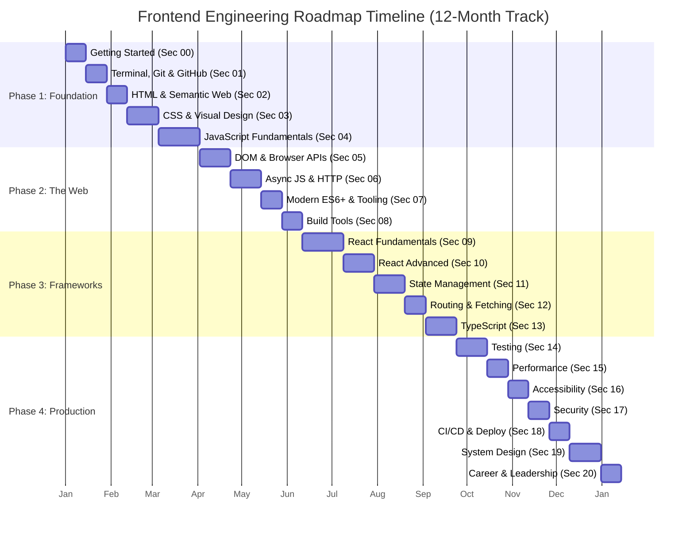

# 🗺️ Frontend Engineering Roadmap

> **From zero to senior frontend engineer — a project-driven, deep-learning path**

---

## Overview

This roadmap is a curated, project-driven curriculum designed to take you from a complete beginner to a confident senior frontend engineer. Unlike traditional roadmaps that list technologies in isolation, this one is built around **understanding how the web works at its core** before adopting frameworks, and **building real projects** at every stage to cement knowledge.

The roadmap is divided into **4 phases** and **20 sections**, each with key topics, estimated time, and hands-on projects.

---

## Philosophy

```
┌─────────────────────────────────────────────────────────────┐
│                                                             │
│   🧠 Core Philosophy                                        │
│                                                             │
│   1. Learn the platform first (HTML, CSS, JS, Browser API)  │
│   2. Build projects with vanilla tools before frameworks    │
│   3. Understand why frameworks exist before using them      │
│   4. Go deep into architecture, performance, and testing    │
│   5. Repeat: build → reflect → refine                       │
│                                                             │
│   "A framework is a solved problem — understand the problem │
│    before adopting the solution."                           │
│                                                             │
└─────────────────────────────────────────────────────────────┘
```

---

## Roadmap Progression

```
                                    ╔═══════════════════╗
                                    ║   PHASE 1:       ║
                                    ║   FOUNDATION     ║
                                    ║   (Sections 0-4) ║
                                    ╚═══════════════════╝
                                            │
                                            ▼
                                    ╔═══════════════════╗
                                    ║   PHASE 2:       ║
                                    ║   THE WEB        ║
                                    ║   (Sections 5-8) ║
                                    ╚═══════════════════╝
                                            │
                                            ▼
                                    ╔═══════════════════╗
                                    ║   PHASE 3:       ║
                                    ║   FRAMEWORKS     ║
                                    ║   (Sections 9-13)║
                                    ╚═══════════════════╝
                                            │
                                            ▼
                                    ╔═══════════════════╗
                                    ║   PHASE 4:       ║
                                    ║   PRODUCTION &   ║
                                    ║   ARCHITECTURE   ║
                                    ║   (Sections 14-20)║
                                    ╚═══════════════════╝
```

---

## Table of Contents

| Phase | # | Section | Link |
|-------|---|---------|------|
| **Foundation** | 00 | Getting Started: How the Web Works | [→](#00-getting-started-how-the-web-works) |
| | 01 | Terminal, Git & GitHub | [→](#01-terminal-git--github) |
| | 02 | HTML & Semantic Web | [→](#02-html--semantic-web) |
| | 03 | CSS & Visual Design | [→](#03-css--visual-design) |
| | 04 | JavaScript Fundamentals | [→](#04-javascript-fundamentals) |
| **The Web** | 05 | DOM, Browser APIs & Events | [→](#05-dom-browser-apis--events) |
| | 06 | Async JavaScript & HTTP | [→](#06-async-javascript--http) |
| | 07 | Modern ES6+ & Tooling | [→](#07-modern-es6--tooling) |
| | 08 | Build Tools & Module System | [→](#08-build-tools--module-system) |
| **Frameworks** | 09 | React Fundamentals | [→](#09-react-fundamentals) |
| | 10 | React Advanced Patterns | [→](#10-react-advanced-patterns) |
| | 11 | State Management | [→](#11-state-management) |
| | 12 | Routing & Data Fetching | [→](#12-routing--data-fetching) |
| | 13 | TypeScript | [→](#13-typescript) |
| **Production** | 14 | Testing | [→](#14-testing) |
| | 15 | Performance Optimization | [→](#15-performance-optimization) |
| | 16 | Accessibility (a11y) | [→](#16-accessibility-a11y) |
| | 17 | Security | [→](#17-security) |
| | 18 | CI/CD & Deployment | [→](#18-cicd--deployment) |
| | 19 | System Design & Architecture | [→](#19-system-design--architecture) |
| | 20 | Soft Skills, Leadership & Career | [→](#20-soft-skills-leadership--career) |

> For the full detailed roadmap with projects and timelines, see [FRONTEND_ROADMAP.md](./FRONTEND_ROADMAP.md).

---

## Prerequisites

| Requirement | Details |
|------------|---------|
| **Computer** | Any modern laptop/desktop (Windows, macOS, Linux) |
| **Internet** | Broadband connection for videos, docs, and package downloads |
| **Browser** | Chrome or Firefox with DevTools experience |
| **Editor** | VS Code (recommended) with basic familiarity |
| **English** | Basic reading comprehension (most resources are in English) |
| **Time** | Minimum 10-15 hours/week for active learning |

**No prior coding experience is required.** If you have some, you can move faster through early sections.

---

## How to Use This Roadmap

```
┌────────────────────────────────────────────────────┐
│                                                    │
│  1. Pick your track (3 / 6 / 12 months)            │
│  2. Go through sections IN ORDER (0 → 20)          │
│  3. For each section:                              │
│     ├── Read the key topics                        │
│     ├── Study resources (docs, videos, tutorials)  │
│     ├── Build the project(s)                       │
│     └── Check off the section ✅                   │
│  4. Build ALL projects — this is non-negotiable    │
│  5. Reflect and revise before moving on            │
│  6. Revisit earlier sections when stuck            │
│                                                    │
└────────────────────────────────────────────────────┘
```

See [LEARNING_GUIDE.md](./LEARNING_GUIDE.md) for detailed study plans, tips, and schedules.

---

## Target Audience

| Level | Description | Starting Point |
|-------|-------------|----------------|
| 🟢 **Beginner** | Never written code or just started HTML/CSS | Section 00 |
| 🟡 **Junior** (0-1 yr) | Knows HTML/CSS/JS basics, building basic sites | Section 05 |
| 🟠 **Mid-level** (1-3 yrs) | Uses React/Vue, builds features, limited system design | Section 10 |
| 🔴 **Senior** (3-5 yrs) | Leads projects, reviews code, mentors juniors | Section 14 |
| ⚫ **Staff/Principal** (5+ yrs) | Architects systems, sets technical direction | Section 18 |

---

## Project-Driven Approach

Every section ends with **one or more projects**. These are not optional. Theory without practice is forgotten within weeks. The projects compound:

```
Section 00 → "Hello, World!" page
Section 01 → Version-controlled portfolio repo
Section 02 → Semantic HTML landing page
Section 03 → Styled portfolio site
Section 04 → Interactive JS calculator
...
Section 20 → Full-scale production app with monitoring
```

By the end, you will have a **portfolio of 20+ projects** demonstrating real skills.

> See [PROJECT_INDEX.md](./PROJECT_INDEX.md) for the complete index of all projects sorted by difficulty.

---

## Machine Coding Preparation

This roadmap also serves as preparation for **frontend machine coding interviews** (also called "frontend coding rounds" or "pair programming rounds"). Each section builds skills tested in these interviews.

> See [MACHINE_CODING_GUIDE.md](./MACHINE_CODING_GUIDE.md) for detailed interview preparation.

---

## Timeline Estimates

| Commitment | Sections Completed | Proficiency |
|-----------|-------------------|-------------|
| 3 months (20 hrs/wk) | Sections 00-08 | Junior-ready |
| 6 months (15 hrs/wk) | Sections 00-14 | Mid-level ready |
| 12 months (10 hrs/wk) | Sections 00-20 | Senior-ready |

> Adjust based on your prior experience and available hours.

---

## Quick Start

1. **Fork/clone** this repository
2. **Read** this README and the [FRONTEND_ROADMAP.md](./FRONTEND_ROADMAP.md)
3. **Choose** your track in [LEARNING_GUIDE.md](./LEARNING_GUIDE.md)
4. **Start** with Section 00 — do not skip
5. **Build** every project before moving on
6. **Track** your progress in the checklist tables
7. **Celebrate** each completed section 🎉

---

## Progress Overview



---

## Contributing

See an error? Want to add a resource? Open a PR or issue. This roadmap is a living document.

---

## License

MIT — free to use, share, and modify.

---

## Final Advice

> "The only way to learn frontend engineering is to build things. Read the docs, watch the talks, but above all — write code. Make mistakes. Break things. Fix them. Ship them. Repeat."

— Start with Section 00. Right now.

---

## Next Steps

| File | Description |
|------|-------------|
| [FRONTEND_ROADMAP.md](./FRONTEND_ROADMAP.md) | Full detailed roadmap with 20 sections, phases, projects |
| [LEARNING_GUIDE.md](./LEARNING_GUIDE.md) | Study plans, tips, resources, progress tracker |
| [PROJECT_INDEX.md](./PROJECT_INDEX.md) | All projects indexed by difficulty with checklists |
| [MACHINE_CODING_GUIDE.md](./MACHINE_CODING_GUIDE.md) | Machine coding interview prep guide |
